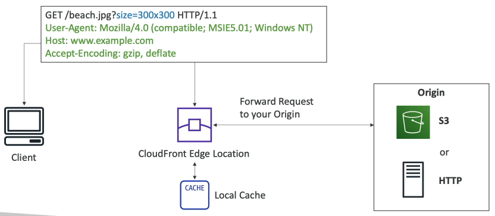
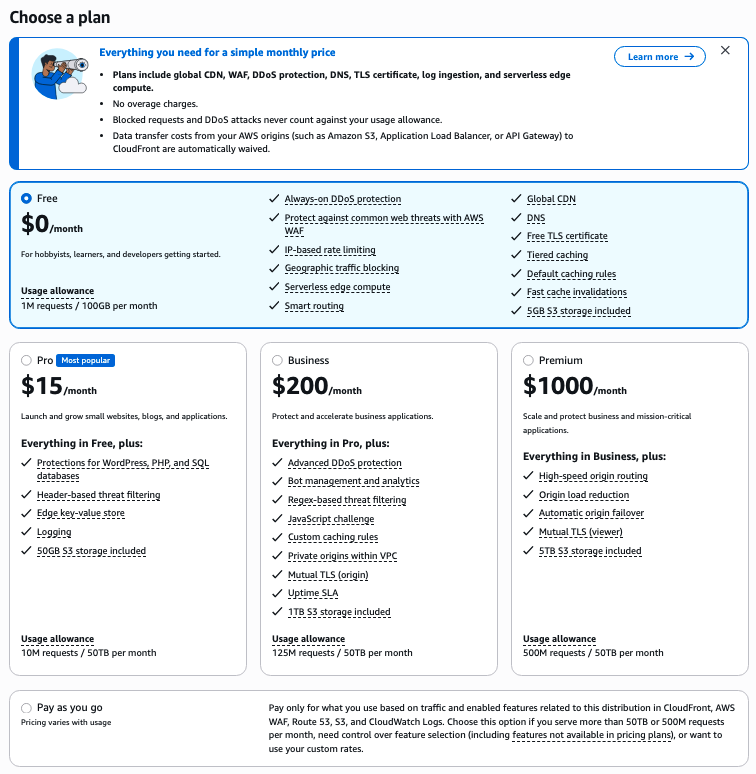
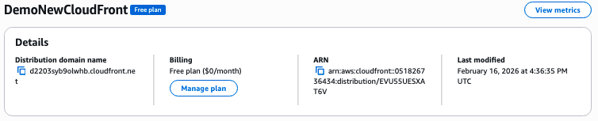
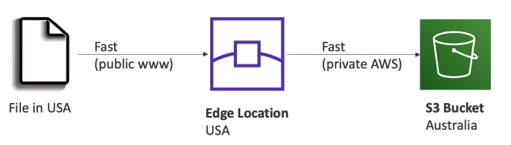
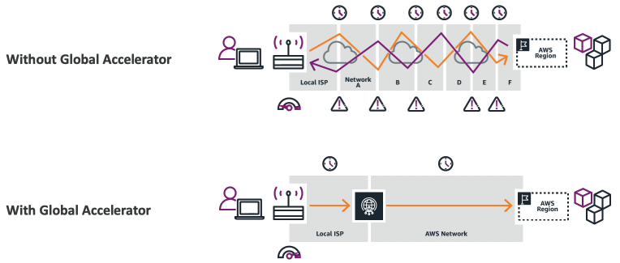
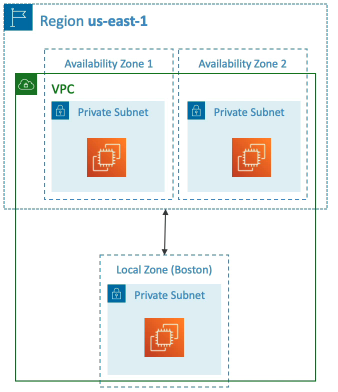
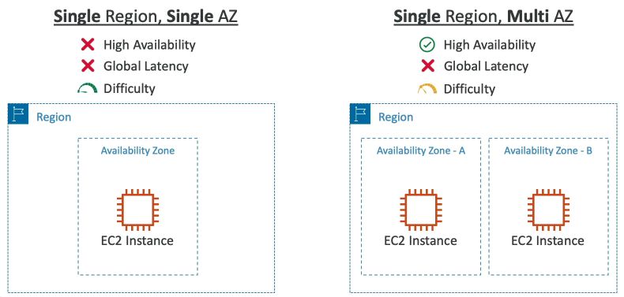
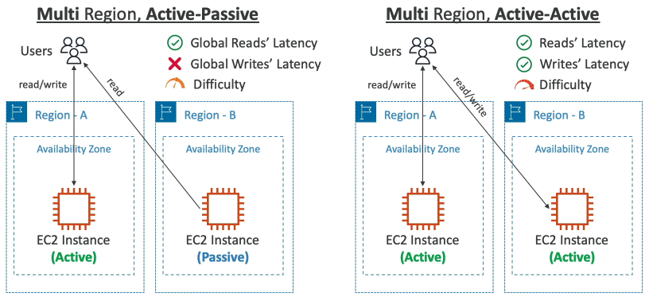

Why should we care to make a **global application**? That is, an application deployed in multiple geographies. This means AWS regions, or **edge locations**. The main advantage is decreased latency, since servers are physically closer to client machines. Also for disaster recovery (DR), in case a region goes down. Another advantage is for attack protection, distributed global infrastructure is harder to attack.

There are a few key **global services** (along with IAM) that we can use to take advantage of the full global infrastructure that we'll explore in this section.

#### DNS

**AWS Route 53** is a managed DNS. Recall that DNS (Domain Name System) is just a collection of rules and **records** for a client to understand how to reach a target server through URLs.

There are many types of Route 53 **records**, some of the most common are:
- **A record**: Domain name to IPv4
	- Example: www.google.come => 12.34.56.78
- **AAAA record**: Domain name to IPv6
	- Example: www.google.come => 2001:0db8:85a3:0000:0000:8a2e:0370:7334
- **CNAME record**: Domain name to Domain name
	- Example: www.search.google.com => www.google.com
- **Alias record**: Domain name to AWS resource (most common: ALB, CloudFront distribution, S3 Static Website, API Gatweay)
	- Example: www.example.com => my-alb-123456.us-east-1.elb.amazonaws.com

Route 53 operates on **routing policies**. There are a few different kind of routing policies:
- **Simple routing policy**: no health checks, just takes in a domain name and sends back the record value
- **Weighted routing policy**: provide weights to different instances to ensure a certain percentage of the traffic goes to each instance. This is a form of load balancing.
- **Latency routing policy**: looks at where the user is located and routes traffic to the instance in the closest region
- **Failover routing policy**: For DR, route to a failover instance if the instance is unhealthy after a health check

### CDN

**AWS CloudFront** is a content delivery network (CDN). Recall that a CDN is a network of edge locations that are closer to users for caching content (like images and videos). It is made up of hundreds of points of presence (edge locations, caches), and makes reads faster, improving user experience. It also provides DDoS protection through integration with **AWS Shield** and **AWS Web Application Firewall (WAF)**

CloudFront has the concept of **origins**, which are basically integrations that you want to connect it to. These include:
- **S3 Bucket**
	- For distributing files and caching them at the edge
	- Supports uploading files to S3 through CloudFront
	- Access between CloudFront and S3 is secured through Origin Access Control (OAC)
- **VPC Origin**
	- For applications hosted in VPC private subnets
	- Connect to Private ALB / NLB / EC2 instances
- **Custom Origin (HTTP)**
	- S3 static website
	- Any public HTTP backend




Let's create an S3 bucket on the CloudFront CDN. Once the bucket is created, we need to create a distribution in CloudFront. Configuration:
- Plan: Many tiers of payment options

- Distribution name
- Distribution Description (optional)
- Domain: For a route 53 managed domain. We don't need this since we're setting up an S3 bucket.
- Origin type: S3, ELB, API Gateway, VPC,  Elemental MediaPackage (for video streaming), Other
	- S3 origin (for S3), we fill `<bucket-name>.us-east-1.amazonaws.com`
	- S3 Origin path (for S3) (optional)
- Protection against Layer 7 DDoS attacks, can. be enabled with the Business Plan+ (>= $200/month)

We'll notice now in S3 the bucket we setup with CloudFront has a bucket policy that CloudFront attached to it:

```json
{
    "Version": "2008-10-17",
    "Id": "PolicyForCloudFrontPrivateContent",
    "Statement": [
        {
            "Sid": "AllowCloudFrontServicePrincipal",
            "Effect": "Allow",
            "Principal": {
                "Service": "cloudfront.amazonaws.com"
            },
            "Action": "s3:GetObject",
            "Resource": "arn:aws:s3:::demo-cloudfront-tylerliq/*",
            "Condition": {
                "ArnLike": {
                    "AWS:SourceArn": "arn:aws:cloudfront::051826736434:distribution/EVU55UESXAT6V"
                }
            }
        }
    ]
}
```

We can see our website now with the images cached rom the created Distribution's domain name:




#### Edge Computing

Suppose we have S3 buckets in many regions across the world and we want to transfer data from all of them to one bucket somewhere. **S3 Transfer Acceleration** can increase the speed by transferring files to an AWS edge location before forwarding data to the target S3 bucket. Use when the target bucket is far away geographically.



Similar to how we can accelerate moving data for S3 buckets, the **AWS Global Accelerator** can be used to reduce latency using the global network for EC2 instances serving you website. Leveraging the AWS internal network can optimize the route from a far away global user to your application by up to 60%, and its fast as it works at the TCP/UDP level. Users send their data to edge locations first which then forward data to your application. This works using 2 **Anycast IPs** which are static IPs for accessing edge servers.



#### Hybrid Cloud by AWS

Consider that you might want to have Hybrid cloud but don't have the hardward expertise to setup the server racks on-prem. You can actually hire AWS to come install them for you and manage them for you, with **AWS Outposts**. These servers offer the same services, APIs, and tools used in AWS to build your own on-prem applications. You are still responsible for the physical security of the rack. Some advantages of AWS Outposts
- Ultra low latency
- Local data processing
- Data residency
- Easier migration from on-prem to cloud
- Fully managed service
- Includes EC2, EBS, S3, ECS, EKS, RDS, EMR

#### Deploy outside Regions

**AWS WaveLength** has **WaveLength Zones**, which are infrastructure deployments embedded within telecommunications providers data centers at the edge of their 5G networks. Using them, you can get very close to users, especially mobile users in Communication Service Provider (CSP) networks outside the AWS network. This is advantageous for a number of reasons:
- Ultra-low latency being on the edge, very close to users
- Traffic stays in the CSP network
- High bandwidth and secure connection to the parent AWS region exists for failover, and for accessing service integrations with the EC2 instance in the WaveLength zone
- No additional charges or service agreements
- Use cases: Smart cities, Connected Vehicles, Interactive Live Video Streams, AR/VR, Real-time Gaming

**AWS Local Zones** allow you to place compute, storage, databases, and other select services directly on the edge instead of proxying with CloudFront. Using them, we extend our VPC to more locations, Local Zones on the edge outside regions. These are NOT the same as Edge Zones, which are only for CDNs and they can't host EC2 instances.




#### Global Architectures


