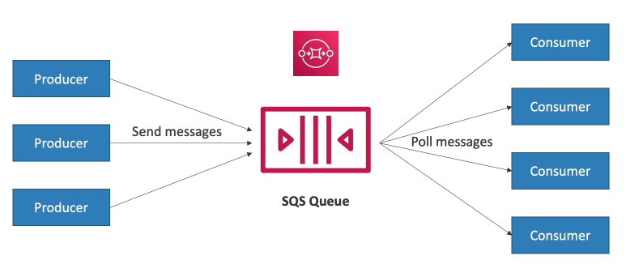
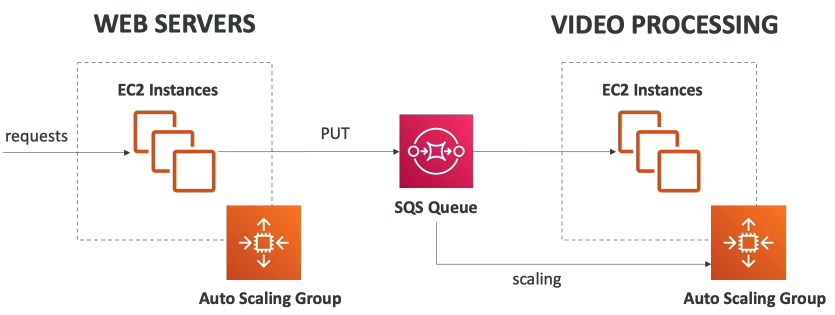
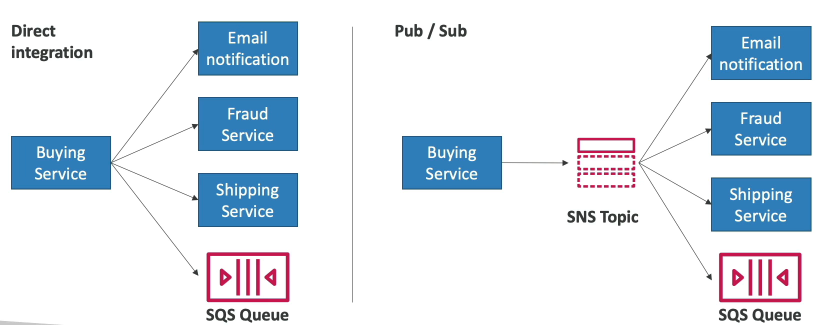

AWS Also provides integrations at the application level for a variety of use cases

Consider you want to implement asynchronous/event based communication from one service to another. This helps solve spikes in traffic, instead of scaling, especially for very long running operations. You can solve this either with a queue model using **AWS SQS (Simple Queue Service)**, or a pub/sub model using **AWS SNS (Simple Notification Service)**, or using real-time data streaming using **AWS Kinesis**. These services can all scale independently from our applications.

SQS is a fully managed queue service that decouples producers (instances that send messages into the queue) and consumers (instances that poll messages from the queue). 
- Scales from 1 message per second to 10K messages per second
- Default retention of messages: 4 days, max 14 days
- No limit to how many messages can be in the queue
- Message are deleted after they are read by consumers
- Low latency (<10ms on send and poll)
- You choose either a Standard queue (best-effort ordering, but scales more) or a FIFO queue (strict ordering) at creation time.

A common pattern is using a queue to decouple different auto scaling groups, maybe for a long running background process in one. SQS Queues can inform auto scaling, for example by number of message.

Kinesis is a managed service to collect process, and analyze real-time streaming data at scale
- Data streams provide low latency streaming to ingest data at scale from hundreds or thousands of sources.
- Data firehose can load kinesis data streams into S3, Redshift, OpenSearch (Open Source ElasticSearch fork)

SNS is a managed service for providing notifications. This solves the problem with messages queues of "how can multiple receivers get my message", since in SQS after one service polls the queue the message is deleted. Using the pub/sub model for decoupling, a service publishes a message to an **SNS Topic**, which then broadcasts a notification to all subscribed services.
- Supports up to 12.5M subscriptions per topic
- 100K topic limit
- Type of subscribers include: SQS Queues, Lambda Functions, Data Firehoses, Emails, SMS & Mobile Phones, HTTP Endpoints.

Another alternative service exists called **AWS MQ**, which is a managed message broker for either RabbitMQ or Active MQ. 
- Useful to migrate from on-prem without too much re-engineering. 
- Can use older messaging protocols: MQTT, AMQP, STOMP, Openwire, Wss
- It does not scale as much as SQS/SNS
- Can run multi-AZ with failover
- Has both queue and topic features