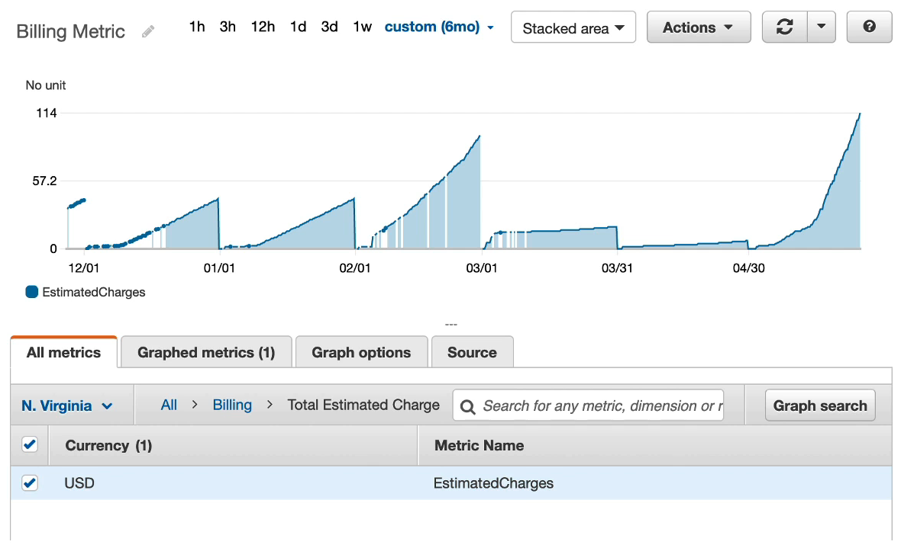
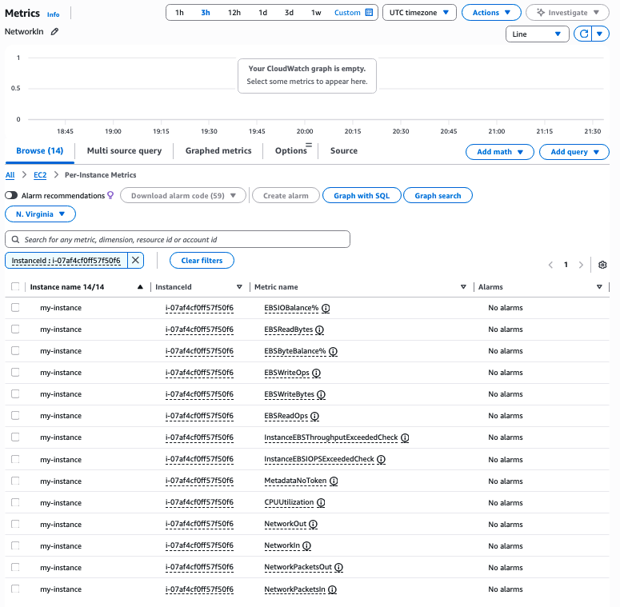
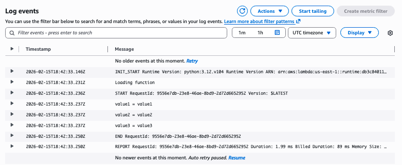
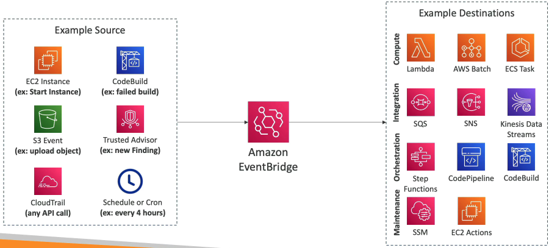
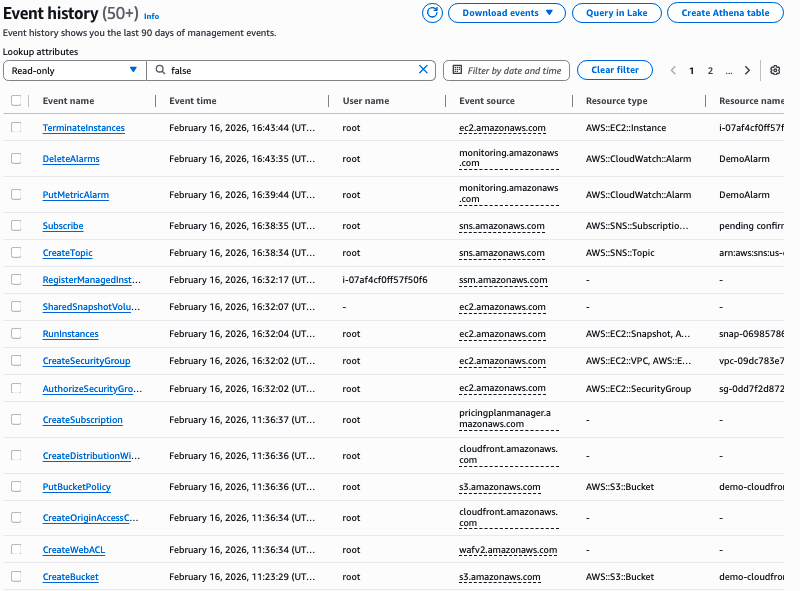
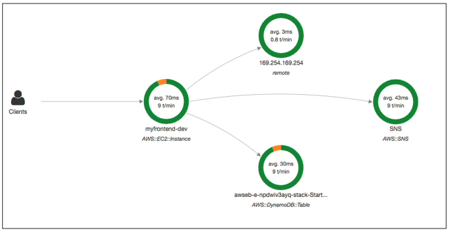

#### Metrics & Alarms

When deploying in the cloud, we want to have ways to see how our deployments are doing in real-time. **CloudWacth Metrics** provides various metrics for every service in AWS. 
- Types of metrics include CPU Utilization, Network I/O etc. 
- Metrics have timestamps
- Can create CloudWatch dashboards of metrics

Here's an example of a dashboard for the billing metric in `us-east-1`

Some important metrics:
- EC2 Instances: CPU Utilization, Status Checks, Network I/O. Note: no RAM
	- Default metrics every 5 minutes
	- Option for detailed monitoring, pay more for metrics every minute
- EBS Volumes: Disk reads/writes
- S3 Buckets: Bucket size (bytes). Number of objects, Number of Requests
- Billing: total estimated charge (only in `us-east-1`)
- Service limits: how much you've been using a service API
- Custom metrics: push your own metrics

Typically we put **CloudWatch Alarms** on our metrics to trigger notifications based on metric values. 
- This can alarm actions like:
	- Auto Scaling: increase/decrease instance count
	- EC2 Actions: stop, terminate, reboot, recover an instance
	- SNS Notifications: send a notification into an SNS topic
- Various options for alarm triggers: sampling, percentage, max, min
- Can choose the period on which to evaluate an alarm

Lets practice creating an alarm. In metrics, click the metric  `CPUUtilization` for the instance ID of a running instance.

We can then configure our alarm to measure the metric for an average of 5 minutes, when CPU Utilization is greater than 80%. We'll also add our email to a new SNS topic to get an email to test this out. Finally, add an alarm name and description which we'll receive by email.

#### Logging

We also have **CloudWatch Logs** that can collect log files from a variety of sources.
- Sources include:
	- Elastic Beanstalk
	- ECS
	- Lambda
	- CloudTrail based on filter
	- Route 53: Log DNS queries
	- **CloudWatch Log Agents**: on EC2 machines or on-prem server, must make sure the instance has the proper IAM role to send log data to CloudWatch Logs
- Enables real-time monitoring of logs
- Adjustable storage retention 

For example, we can see a log stream from our Lambda function from earlier:

#### Event Bus
 
 **AWS EventBridge (formerly CloudWatch Events)** is a serverless event bus that routes events from AWS services or apps to targets like Lambda, SQS, or SNS based on rules you define
 - Cron jobs: scheduled scripts
	 - Example: Send events to lambda once per hour
 - Event pattern: event rules to react to a service doing something
	 - Example: IAM Root User sign in event publishes a message to an SNS topic to email people to tell them, since we shouldn't be using the root account.

Here's a full diagram of EventBridge rules:

There are **Event Bus** options other than the default one
- Default Event Bus: events from AWS Services
- Partner Event Bus: events from 3rd party service (e.g., ZenDesk, Datadog)
- Custom Event Bus: events from apps

EventBridge comes with some other features:
- **Schema Registry**: work with the schema/model of the event data
- **Event Archive**: For a set period, or indefinitely store events. Search/filter through them easily.
- **Replay archived events**

#### Auditing

**AWS CloudTrail** provides governance, compliance, and auditing on your AWS Account. It is enabled by default!

CloudTrail can provide a history of events / API calls made in your AWS account by all methods (Management console, SDK, CLI, IAM Users & Roles)
- Logs can go to CloudWatch Logs or S3
- Trails can be applied to all regions (default) or just for one region

Here's part of the event history for the last couple of days while doing this course:

#### Tracing

**AWS X-Ray** is a distributed tracing service that helps you analyze and debug applications by tracking requests as they flow through your services and visualizing latency, errors, and bottlenecks. This is great for microservices!

#### AWS Service Health

The **AWS Health Dashboard** is a global service that provides a bunch of information on AWS Service health on their end.
- **Service history:** tells us what services are up and running, acting as a down detector on AWS's end. It shows all services in all regions health over time. You can subscribe to an RSS feed.
- **Your Account**: provides alerts and remediation guidance when AWS is experiencing events that may impact you. It provides proactive notifications to help you plan for scheduled activities (for example, during times of maintenance)