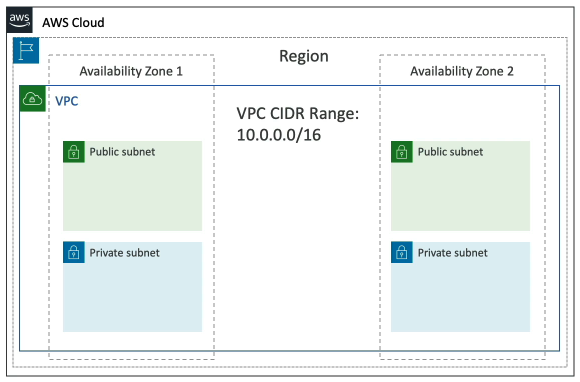
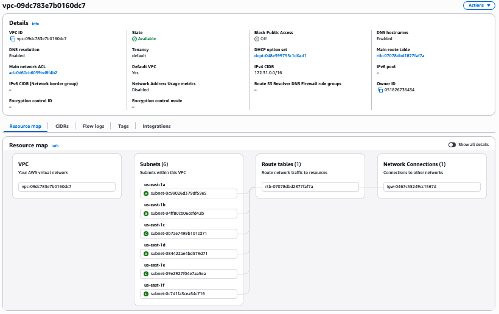
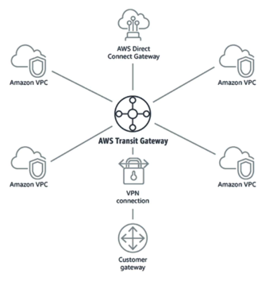

> Note: VPCs are complicated topic that we will just cover on a surface level for this course. It is covered much more in depth for the Certified Solutions Architect Associate and SysOps Administrator courses.

#### IP Addresses

**IPv4**: Internet Protocol version 4
- 4.3 billion possible addresses
- Can be public (globally routable, accessible from the internet) 
- Can be private (used inside internal LAN networks, e.g., 192.168.1.1)
- EC2 instances get a new public IP every time you stop and then start it (default behaviour)
- EC2 instances keep the same private IP when stopped/started
- Public IPv4 addressed are charged at $0.005/hour, including EIPs
- **Elastic IP (EIP)** allows you to attach a fixed public IPv4 address to an EC2 instance, and has an ongoing cost even if not in use

**IPv6**: Internet Protocol version 6
- 3.4E38 possible addresses
- All AWS IPv6 addresses are public
- Free in AWS

**CIDR (Classless Inter-Domain Routing)**: Defines IP address ranges using a slash notation
- The number after the slash (e.g., /24) represents how many bits are reserved for the **network portion**. The remaining bits (32 − CIDR number) are used for the **host portion**
- Network bits identify the subnet; host bits identify individual machines inside that subnet
- Smaller slash number = fewer network bits = more host bits = larger network range (e.g., /16 is larger than /24)
- Example: 192.168.1.0/24
    - 24 network bits
    - 8 host bits (32 total bits − 24 network bits)
    - 8 hots bits => 256 total possible IP addresses in this network

#### VPC Core Components

A **Virtual Private Cloud (VPC)** is a private network to deploy your AWS resources in
- Linked to a specific region
- **Subnets** in the VPC are a partition of a VPC linked to a specific AZ. 
	- They Can be public or private.
	- Use an **internet gateway** connected through a route to a public subnet for instances in it to gain access to the internet
	- Use a **NAT Gateway** (AWS-Managed) or a **NAT Instance** (Self-Managed) to allow instances in private subnet to gain access to the internet while remaining private 
- Use **route tables** to defined access between subnets and the internet

When we created our first EC2 instance earlier in this course, a default VPC was created for us. Let's have a look now into what that looks like.

We also need to make sure our VPC is secure. There's two ways of securing a VPC, Security Groups which we already know about from earlier, and NACLs.
- **Network Access Control List (NACL)**
	- A firewall which controls traffic to and from a subnet. Automatically applies to all EC2 instances or other AWS resources in the subnet
	- Can have `ALLOW` or `DENY` rules for specific IP addresses
	- Stateless subnet rules: The firewall does NOT remember if a connection is allowed, inbound connections are NOT automatically allowed to carry data outbound too
- **Security Groups**
	- A firewall which controls traffic to and from an EC2 Instance
	- Can only have `ALLOW` rules
	- Rules can be for IP addresses or other security groups
	- Stateful subnet rules: The firewall remembers if a connection is allowed, and thus inbound connections are automatically allowed to carry data outbound too

**VPC Flow Logs** capture information about traffic going in and out a VPC
- Flow Logs exist for different levels
	- VPC level logs
	- Subnet level logs
	- Elastic Network Interface logs (A virtual network card you can attach to a resource inside a VPC)
- Helps to monitor and troubleshoot connectivity issues
	- Subnet to internet
	- Subnet to subnet
	- Internet to subnet
- Captures network information from AWS managed resources too
- Logs can go be directed to S3, CloudWatch Logs, or Kinesis Firehose.

#### VPC Connectivity

**VPC Peering** allows connecting two VPC privately inside the AWS network
- Makes them behave as if they were in the same network
- CIDR ranges cannot overlap
- Peering is not transitive (i.e., you must connect each VPC individually, connecting VPC A to VPC B does not automatically connect VPC B to VPC C, if VPC A and VPC C were already connected)

**VPC Endpoints** allow you to connect to AWS Services using a private network instead of the public internet. This also provides better security & Lower Latency.
- 2 different kinds of endpoints
	- **VPC Endpoint Gateway**: For S3 & DynamoDB
	- **VPC Endpoint Interface**: For most services (including S3 & DynamoDB)
- **AWS PrivateLink** is the most scalable and secure way to to expose a service in your AWS VPC to 1000s of other AWS VPCs at once
	- No peering, internet gateway, NAT, or route tables needed
	- Connects through a Network Load Balancer (Service VPC) and an Elastic Network Interface (Service Consumer VPC)

Suppose you want to have a hybrid cloud setup, where you connect an on-prem network to an AWS VPC. There are several solutions:
- **Site to Site VPN**: A **Virtual Private Network (VPN)** is just an encrypted tunnel over the public internet to connect two networks (in this case, on-prem to an AWS VPC)
	- On-prem network needs a **Customer Gateway (CGW)**
	- AWS uses a **Virtual Private Gateway (VGW)**
- **Direct Connect (DX)**: For a faster & private option, establish a physical connection to the AWS network, through a Direct Connect partner. Takes at least a month to establish.
- **AWS Client VPN***: To connect individual machines to a VPC using OpenVPN. 

**AWS Transit Gateway** ties VPC connectivity together, acting as a central hub for connecting multiple VPCs and on-prem networks.
- Simplifies network architecture (everything connects to a central transit gateway instead of managing lots of individual connections)
- Supports connections to VPCs, Site-to-Site VPN, and Direct Connect
- Scales to thousands of VPC attachments

