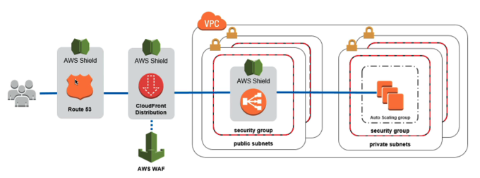

#### Network Protection

Earlier in the CDN section of [Global Infrastructure](10.%20Global%20Infrastructure.md) we mentioned we can get DDoS protection using **AWS Shield** and **AWS Web Application Firewall (WAF)** integrated with CloudFront and Route 53 These protect at the subnet level. Let's dive into more details.
- **AWS Shield Standard**: DDoS protection at no additional Cost
	- Protection from layer 3/4 attacks (SYN/UDP Floods, Reflection Attacks)
- **AWS Shield Advanced**: Premium DDoS protection
	- Protects against more sophisticated attacks, 
	- Cost spike protection
	- 24/7 access to AWS DDoS response team
	- $3K/month/organization
- **AWS WAF**: Filter specific requests based on rules
	- Protection from Layer 7 attacks
	- Deploy on ALB, API Gateway, CLoudFront
	- Define a Web Access Control List
		- Rules can include IP addresses, HTTP headers, HTTP body, URI strings
		- Protects against common attacks: SQL injection, XSS, etc
		- Request sizing constraints
		- Geo-matching (block countries)
		- Rate limiting.

> Note: DDoS protection also means being ready to scale if an attacker makes it through to instances with an ASG appropriately configured, to absorb the traffic

  
We can also protect an entire VPC at once use **AWS Network Firewall**.
- Protect all layers from 3 to 7
- Inspect & Protect against all connections to the VPC
	- VPC to VPC
	- Outbound to internet
	- Inbound from internet
	- To / from Direct Connect & Sift-to-Site

**AWS Firewall Manager** is another tool to manage security rules for all IAM accounts in your organization. Rules are applied to all new resources as they are created in all IAM accounts.
- Manage VPC security groups
- Manage WAF rules
- Manage AWS Shield Advanced Rules
- Manage AWS Network Firewall

Finally, we can test all of our security practices by doing **Penetration Testing**.
- Only 8 services you can do this for without prior approval
	- EC2, NAT Gateways, ELB
	- RDS
	- CloudFront
	- Aurora
	- API Gateways
	- Lambda Functions
	- Lightsail Resources
	- Elastic Beanstalk
- Some activities are prohibited on AWS:
	- DNS Zone walking via Route 53 Hosted Zones (enumerating all the DNS records in a domain by exploiting misconfigured DNS settings to discover internal/hidden services)
	- DoS/DDoS-ing yourself
	- Port flooding
	- Protocol flooding
	- Request flooding

#### Data Protection

There are two types of **encryption** in AWS that we want to enforce ideally all the time. Encryption occurs using **encryption keys**.
  - **Data at Rest**: Encrypt Data stored or archived on a device (RDS, S3, EBS, EFS etc.)
  - **Data in Transit**: Encrypt data as it moves through networks (On-prem to AWS, EC2 to DynamoDB, etc.)

The AWS Service at the core of encryption is **AWS Key Management Service (KMS)**. KMS manages encryption keys for us, we don't get access to the keys.
- Some services are KMS encryption opt-in
	- EBS Volumes
	- S3 (S3 has its own encryption that is enabled by default, but its opt-in with KMS)
	- Redshift
	- RDS
	- EFS
- Some services have KMS encryption automatically enabled
	- CloudTrail
	- S3 Glacier
	- Storage Gateway
- **Customer Managed Keys** are keys you manage, and enable/disable yourself
	- Set rotation policies
	- Can do bring-your-own-key
	- Cost money to create
- **AWS Managed Keys** are created, managed, and used on your behalf by AWS in your account
	- Used by AWS Services automatically
- **AWS Owned Keys**: Keys that an AWS service owns and manages, not tied to an account
	- Used across multiple accounts
	- AWS can use them to protect resources in your account
	- You can't view them in KMS, you have no control

Another encryption service is **AWS CloudHSM**.
- AWS Provisions the encryption hardware instead of managing the software like KMS
- You get a dedicated tamper resistant hardware security module (HSM)
- CloudHSM Keys generated from the device, you manage them yourself
- Expensive

AWS also has a certificate manager for SSL/TLS certifications for HTTPS endpoints. **AWS Certificate Manager (ACM)** lets you easily provision, manage, and deploy certificates.
- Loads certifications automatically onto services to provide HTTPS for clients (ELB, CloudFront, API Gateway)
- Supports both public and private TLS certifications
- Public certificates are free
- Automatic TLS certificate 

More broadly than just keys, **AWS Secrets Manager** helps for managing secrets broadly
- Can force secret rotation
- Can automate generation of secrets using Lambda
- Integrates with RDS (MySQL, PostgreSQL, Aurora) for DB secrets
- Secrets encrypted using KMS

**AWS Macie** is a fully managed data security and privacy service that uses ML and pattern recognition to protect sensitive data in S3.
- Alerts you to sensitive data like PII through EventBridge

#### Threat Detection 

**AWS Security Hub** is a central security tool to manage security across several AWS accounts
- Dashboards showing current security and compliance statuses to quickly take action
- Aggregates alerts in predefined or personal findings from various AWS services 
	- AWS Config
	- AWS GuardDuty
	- AWS Inspector
	- AWS Macie
	- AWS IAM Access Analyzer
	- AWS Systems Manager
	- AWS Firewall Manager
	- AWS Health
	- AWS Partner Network Solutions
- Must first enable AWS Config

**AWS GuardDuty** provides intelligent ML-based threat detection.
- One-click enable (30 day free trial)
- Analysis based on data from a variety of sources
	- CloudTrail Events Logs: Unusual API calls, unauthorized deployments
	- VPC Flow Logs: Unusual internal traffic, unusual IP addresses
	- DNS Logs: Compromised EC2 instances sending encoded data within DNS queries
	- Optional Features: Audit logs from EKS, RDS/Aurora, EBS , Lambda, S3, and more
- Can setup EventBridge rules to be notified in case of findings
	- EventBridge rules can target Lambda or SNS
- Can protect against cryptocurrency attacks

**AWS Inspector** runs automated security assessments at the application level. 
- It is integrated with AWS Security Hub, and sends reports there
- Can also send findings to Event Bridge. 
- Assigns a risk score to vulnerabilities for prioritization
- It works against a variety of services:
	- EC2 : Leverages at SSM agent to analyze against unintended network accessibility, and known OS vulnerabilities
	- ECS: Assessment of container images when pushed to ECR
	- Lambda: Identifies software vulnerabilities in function code and package dependencies (looks for CVEs) when functions are deployed

**AWS Detective** helps with root cause analysis of security issues from a variety of threat detection and compliance AWS Services (GuardDuty, Security Hub, Macie)
- Analyzes investigates, and quickly identifies the root cause of security issues using ML
- Automatically collects and processes events from VPC Flow Logs, CloudTrail, and GuardDuty to create a unified view
- Produces visualizations with details and context

**IAM Access Analyzer** allows you to find out which resources are shared externally.
- Covers many resources
	- S3 Buckets
	- IAM Roles
	- KMS Keys
	- Lambda Functions
	- SQS Queues
	- Secrets Manager Secrets
- Define a **Zone of Trust** for an IAM or root account
	- Anything outside the Zone of Trust is reported as a finding in IAM Access Analyzer a potential threat

#### Compliance

**AWS Artifact** is a portal to access compliance documentation and AWS agreements. It's not really a service, as it doesn't provide anything, its just a list of reports and agreements.
- **Artifact Reports**: AWS security and compliance documents from 3rd part auditors (ISO certifications, PCI, SOC)
- **Artifact Agreements**: allowing you to review, accept, and track the status of AWS agreements (BAA, HIPAA)

**AWS Config** helps with auditing and recording compliance of AWS resources
- Records compliance & configurations of resources over time
- Can store the data in S3, to be later analyzed by Athena
- Can answer security & compliance questions like:
	- Is there unrestricted SSH access in my security groups?
	- Do any of my buckets have public access?
	- How has my ALB configuration changed over time?
- Can integrate with SNS to send alerts for configuration changes
- Per-region service, but can be aggregated across regions and accounts
- View CloudTrail API calls if enabled

**AWS Abuse** allows reporting AWS resources used for abusive or illegal purpose. These behaviours include:
- Spam: receiving undesired emails from AWS-owned IP address, websites & forums spammed by AWS resources
- Port scanning: sending packets to your ports to discover the unsecured ones
- DoS or DDoS attacks: AWS-owned IP addresses attempting to overwhelm or crash your servers/software
- Intrusion attempts: logging in on your resources
- Hosting objectionable or copyrighted content: distributing illegal or copyrighted content without consent
- Distributing malware: AWS resources distributing software to harm computers or machines
