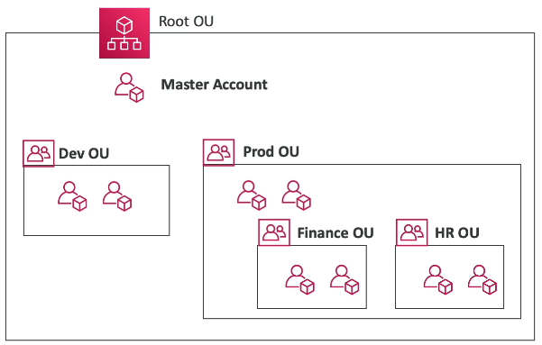
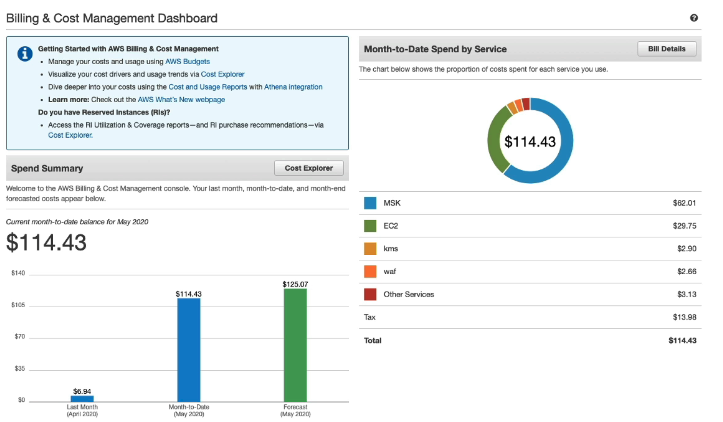

#### Account Management

**AWS Organizations** is a global service that allows managing multiple root accounts
- One of the accounts is the management (formerly master) account, other accounts are member accounts
- Consolidated billing across all accounts provides cost benefits
	- Pooling of reserved EC2 instances
	- Aggregated usage for better volume pricing
	- Savings Plan discounts
	- Only deal with one bill for all AWS accounts in the org
- API available to automate AWS account creation
- Separate accounts into **organizational units (OUs)**
- Restrict account privileges using a **Service Control Policies (SCPs)**
	- Whitelist or blacklist IAM actions
	- Applied at the OU level or account level, to both IAM users/roles and the root account
	- Does not apply to the management (formerly master) account
	- Must have explicit `ALLOW`, nothing is allowed by default
	- Looks exactly like an IAM policy JSON object.
	- Use cases: restrict access to certain services, enforce PCI compliance

Using multiple accounts lends to different strategies
- Different ways to motivate how to separate accounts into OUs
	- By department
	- By dev/test/prod users
	- Based on regulatory restrictions (using SCPs),
	- For better resource isolation (e.g., multi account vs. single account multi-VPC)
	- For different service limits
	- For isolated logging
- Send logs from CloudTrail/CloudWatch to a central account's S3

**AWS Control Tower** provides an easy way to set up and govern a secure and compliant multi-account AWS environment based on best practices. It build on top of AWS Organizations.
- Automate setup of environment 
- Automate ongoing policy management using guardrails
- Detect policy violations and remediate them
- Monitor compliance through an interact dashboard
- Sets up AWS Organizations to organize accounts and implement SCPs

**AWS Resource Access Manager (RAM)** helps with sharing AWS resources across accounts
- Avoid resource duplication

**AWS Service Catalog** solves the problem that new AWS users have too many options and may create stacks that are not compliant / in line with the rest of an organization.
- Create a quick self-service portal to launch a set of authroized products pre-defined by admins
- Admins create "products" that IAM users can use, they are just CloudFormation templates

#### Billing

AWS has 4 different *pricing models*
- **Pay as you go**: pay for what you use, meet scale demands
- **Save when you reserve**: minimize risks, predictable manage budgets to comply with long-term budget requirements
- **Pay less by using more**: volume based-discounts
- **Pay less as AWS grows**: AWS provides cost reductions over time as AWS reaches further economies of scale

Some services in AWS you can get for free with the free plan
- With a new AWS account you get $200 in credits
- Choose between free or paid plan
	- Free plan expires in 5 months or when credits are consumed
	- Both plans have access to "Always Free" Services
		- Ex: Lambda has 1M requests/month and 400,000 GB\*s/month free
		- Ex: DynamoDB has 25GB of storage and 200M requests/month free

**AWS Compute Optimizer** is a service that gives recommendations to reduce costs and improve performance by recommending optimal resources for your workloads
- Helps choose optimal configurations so you don't over/under provision
- Uses ML to analyze resource configurations and utilization CloudWatch metrics
- Recommendations can be exported to S3

There a number of billing and costing tools available in AWS for various functions
- **Estimating costs in the cloud**
	- Pricing : https://calculator.aws/
- **Tracking costs in the cloud**
	- Billing Dashboard
	- Cost Allocation Tags
	- Cost and Usage Reports
	- Cost Explorer
		- Visualize, understand, and manage AWS costs and usage over time
		- Create custom reports (compared to cost and usage reports)
		- Monthly, hourly, or resource level granularity
		- Choose an optimal savings plan to lower prices
		- Forecast usage up to 12 months based on previous usage
- **Monitoring against cost plans**
	- Billing Alarms
		- Send alarms when costs exceed a threshold
		- Billing data metric in CloudWatch stored only in `us-east-1` for worldwide costs
	- Budgets
		- Create budgets and send alarms when costs exceed OR are forecasted to exceed the budget
		- 4 types of budgets: Usage, Cost, Reservation, Savings Plan
		- Track utilization of reserved instances
		- Up to 5 SNS noifications per budget
		- Filter by service, account, tag, purchase option, instance type, region, AZ...

**AWS Cost Anomaly Detection** continuously monitors cost and usage using ML to detect unusual spends.
- Learns your unique historical patterns 
- Detects both one-time spikes and continuous increases
- Sends an anomaly detection report with root cause analysis
- Individual alerts, or daily/weekly summary (using SNS)

**AWS Service Quotas** notify you when you're close to a quota threshold for a specific service
- Create CloudWatch alarms on the Service Quotas console
- Request quota increases or shutdown resources before the limit is reached
#### Support

**AWS Trusted Advisor** is a service that gives a high level assessment on your account
- 6 categories of recommendations
	- Cost optimization
	- Performance
	- Security
	- Fault tolerance
	- Service limits
	- Operational excellence
- 4 different support plans based on your total spend on AWS that each have all the features of cheaper plans plus added features at each plan level
	- Basic Support Plan
		- 24/7 access to customer service, documentation, whitepapers, and support forums
		- AWS personal health dashboard, a personalized view of the health of services and alerts when resources are unhealthy
	- Basic Support Plan+
		- Business hours email access to cloud support associates
		- Unlimited cases / unlimited contacts
		- <24 business hour case response time, or <12 business hours for System Impaired
	- Business Support Plan
		- Intended to be used for production workloads
		- 24/7 phone, email, and chat access to Cloud Support Engineers
		- Access to infrastructure event management for an additional fee
		- <4 business hours response time for Production System Impaired
	- Enterprise On-Ramp Support Plan
		- Intended to be used for production / business critical workloads
		- Access to a pool of technical account managers
		- Concierge Support Team (for billing and account best practices)
		- Infrastructure event management, well-architected & operations reviews provided
		- <1 business hour response time for Production System Down
		- <30 minute response time for Business-Critical System Down
	- Enterprise support plan
		- Intended for mission critical workloads
		- Access to a dedicated technical account manager
		- Access to AWS incident detection and response (for an additional fee)
		- <15 minute response time for Business-Critical System Down