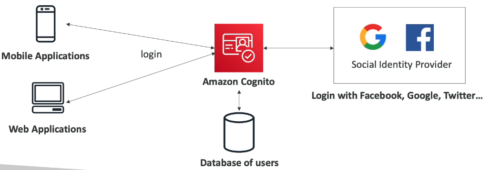

**AWS Security Token Service (STS)** enables you to create temporary, limited-privileges credentials to access AWS resources
- Short term credentials, you configure expiration periods
- Use cases: identity federation (manage identities in external systems, provide them with STS tokens to access AWS resources), IAM roles

**AWS Cognito** provides identity at the application level, scaling to millions of users
- Integrations with 3rd party identity providers (Google, Facebook, etc.)

**AWS Directory Services** provides different flavours of directory for identity management
- AWS Managed Microsoft AD
	- Create your own AD in AWS, manage users locally, supports MFA
	- Establish "trust" connections with your on-prem AD
- AD Connector
	- Directory Gateway (proxy) to redirect to on-prem AD
	- Users managed on the on-prem AD
- Simple AD
	- AD-compatible managed directory on AWS
	- Can't be joined with an on-prem AD

**AWS IAM Identity Center (successor to AWS SSO)** provides SSO for all accounts in all AWS organizations. It's like a "login with AWS" that can work internall or externally to AWS.
- Works across business cloud apps (Salesforce, Box, MS365)
- SAML 2.0 enabled apps
- EC2 Windows Instances
- Supports both built-in IAM identities and 3rd part identity providers (AD, Okta, etc.)