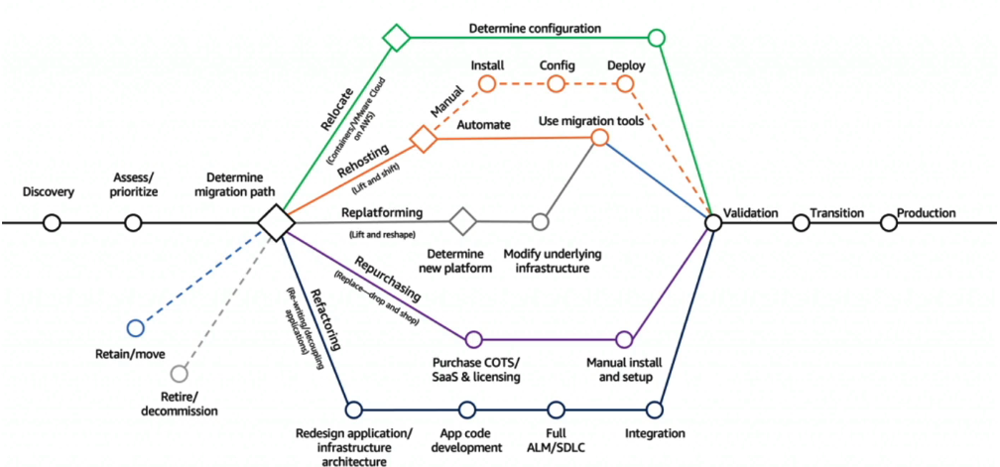
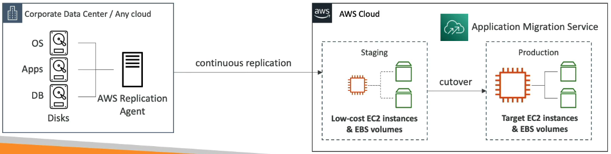
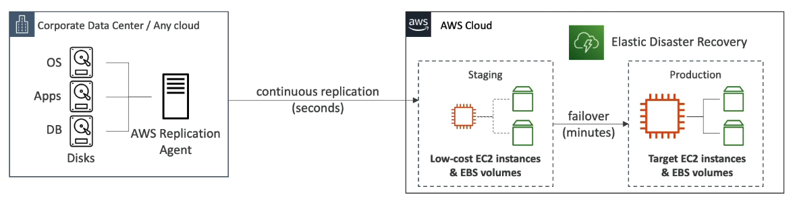

#### Mobile, Desktop & Frontend

**AWS Workspaces** is a managed Desktop as a Service solution to easily provision Windows or Linux websites.
- Great to eliminate management of on-prem virtual desktop infrastructure (VDI)
- Fast and scalable to thousands of users
- Secured data with KMS
- Pay-as-you-go with monthly or hourly rates

**AWS AppStream 2.0** is a desktop application streaming service
- Delivery to any computer without acquiring or provisioning any infrastructure
- The app is delivered from within a web browser

**AWS Amplify** is a set of tools and services to develop full stack web and mobile applications
- Auth, Storage, APIs (REST, GrapQL), CI/CD, Pub/Sub, Analytics, AI/ML Predictions, Monitoring, GitHub
- Basically the Elastic Beanstalk of mobile apps

**AWS AppSync** stores and sync data across mobile and web aps in real-time with GraphQL
- Client code for APIs generated automatically
- Integrates with DynamoDB & Lambda
- Real-time subscriptions to data
- Offline data synchronization
- Fine Grained Security
- Can be leveraged by AWS Amplify

**AWS Device Farm** is a fully managed service to test your web and mobile apps against desktop browsers, real mobile devices, and tablets
- Run tests concurrently on multiple devices
- Configure device settings (GPS, language, Wi-Fi, Bluetooth)
#### Migration & Data Movement

We can think about different cloud migration stragies in terms of **the 7Rs**
- **Retire**
	- Turn off things you don't need anymore (maybe as the result of re-architecting)
	- Helps with reducing the surface areas for attacks (more security)
	- Save on costs for the retired resources/services
- **Retain**
	- Do nothing for now (still counts as a decision to make regarding cloud migration)
	- May want to keep on-prem for security, data compliance, performance
	- There might just not be business value in mirgating or its too compliacted
- **Relocate**
	- Move apps from on-prem cloud-native (containerized system) to to cloud version at the infrastructure/VM level
	- Move EC2 instances to a different VPC, account, or region
- **Rehost (lift & shift)**
	- No cloud optimizations being done, migrate app as is
	- Migrate machines into the AWS Cloud
	- Example: migrate using AWS Migration Service
- **Replatform (lift & reshape)**
	- Not changing core architecture, but leverage some cloud optimizations
	- Save time and money by moving to a fully managed service or serverless
	- Example: migrate your DB to RDS, migrate your app to Elastic Beanstalk
- **Repurchase (drop & shop)**
	- Moving to a different product while moving to the cloud
	- Often you move to a SaaS platform
	- Expensive in the short term but quick to deploy
	- Examples: CRM to Salesforce, HR to Workday
- **Refactor/Re-architect**
	- Reimagining how the app is architected using cloud native features
	- Driven by the business need to add features and improve scalability, performance, security, agility
	- Often means moving from a monolith to microservices

**AWS DataSync** helps with moving large amounts of data from on-prem to AWS
- Synchronizes with S3 (any storage class), EFS, and FSx for Windows
- You can schedule replication tasks hourly, daily, or weekly
- Replication tasks are incremental after the first full load
- Works through the DataSync agent installed on-prem

**AWS Application Discovery Service** allows you to plan migration projects by gathering information about on-prem data centres. 
- Important data collected includes server utilization data and dependency mappings
- Discovery has 2 different ways it can work
	- Agentless Discovery with AWS Agentless Discovery Connector provides VM inventory, configuration, performance history (CPU, RAM, I/O)
	- Agent-based Discovery with AWS Application Discovery Agent gives you more information, including more details for configuration, system performance, inforamtion on running process, and details of network connections between systems
- Resulting data can be viewed in AWS Migration Hub

**AWS Application Migration Service (MGN) (formerly AWS CloudEndure Migration)** executes a rehosting (lift & shift) migration. 
- Converts physical, virtual, and cloud-based servers to run natively on AWS
- Continuous block-level replication of servers
	- An AWS Replication Agent is installed on-prem executes the replication continuously into a staging environment in AWS to keep costs low. When you're ready, cutover to the production AWS cloud environment.

**AWS Migration Evaluator** helps you build a data-drive business case for migration to AWS
- Provides a clear baseline of what your business is running today
- Install agentless collector to conduct broad-based-discovery
- Take a snapshot of on-prem footprint, server dependencies, etc.
- Analyze current state, define target state, then develop a migration plan

**AWS Migration Hub** is a central location to collect servers and application inventory data for the assessment, planning, and tracking of migrations to AWS.
- Helps accelerate your migration, can automate lift-and-shift
- AWS Migration Hub Orchestrator provides pre-built templates to save time and effort in migrating enterprise apps (e.g., SAP, SQL Server, ...)
- Supports migrations status updates from Application Migration Service (MGN) and Database Migration Service (DMS)
#### Backups & Disaster Recovery

**AWS Backup** is a fully managed service to centrally manage and automate backups across AWS Services
- ON-demand and scheduled backups
- Supports Point-in-time Recovery (PITR)
- Retention Periods, Lifecycle Management, Backup Policies...
- Cross-Region Backups
- Cross-Account Backups using AWS Organizations

**AWS Elastic Disaster Recovery (DRS) (formerly CloudEndure Disaster Recovery)** is a quick and easy way to recover your physical, virtual, and cloud-based servers into AWS.
- Example: protect your most critical databases (including Oracle, MySQL, SQL Server), enterprise apps (SAP), protect data from ransomware attacks
- Different disaster recover strategies:
	- Backup and Restore: Backup on-prem data to the cloud (S3) and recover in case of disaster from the cloud
	- Pilot Light: Core components are running in the cloud with a light setup, the rest is on-prem. In case of disaster on-prem you can quickly scale up from what's already in teh cloud
	- Warm Standby: Same as pilot light, but a full version of the app is in the cloud, but at minimum size.
	- Multi-Site / Hot-Site: A full version of the app at full size is in the cloud
- Continuous block-level replication of servers
	- An AWS Replication Agent is installed on-prem executes the replication continously into a staging environment in AWS to keep costs low. When disaster strikes on-prem, failover from staging to production

**AWS Fault Injection Simulator (FIS)** is a fully managed service for running fault injection experiments on AWS Workloads.
- Based on the idea of **chaos engineering**, which means stressing an application by creating disruptive events (e.g., sudden increase in CPU or RAM usage), and then observing how the system responds and implementing improvements
- Helps you uncover hidden bugs and performance bottlenecks before disaster strikes
- Use pre-built templates that generate the desires disruptions
- Supports EC2, ECS, EKS, RDS, and more
#### Other Services

**AWS IoT Core** allows you to connect IoT devices to the AWS Cloud
- Pub/sub model
- Serverless, secure, and scalable to billions of devices and trillions of messages
- Integrates with a lot of AWS Services (Lambda, S3, SageMaker, etc.)
- Build IoT apps that gather, process, analyze, and act on IoT data

**AWS Infrastructure Composer** provides a way to visually design and build serverless apps with a drag-and-drop no-code that represents IaC
- Deploy IaC without needing to be an expert in IaC
- Generates the IaC using CloudFormation
- Can also import existing CloudFormation template

**AWS Ground Station** is a fully managed service that lets you control satellite communcations, process data, and scale your satelite operations.
- Provides a global network of satellite ground stations near AWS regions
- Allows you to download satellite data to your VPC within seconds
- Send satellite data to S3 or EC2
- Use cases: weather forecasting ,surface imaging, video broadcasts

**AWS Pinpoint** is a scalable, 2-way (outbond/inbound) marketing communications service
- Supports email, SMS, push, voice, and in-app messaging
- Can segment and personalize messages for different customers
- Can receive replies from customers, scaling to billions of messages per day
- Different from SNS & SES because it supports targeted campaigns, personalized messaging, and analytics across multiple channels
- Use cases: run campaigns by sending marketing, bulk transaction SMS messages

**AWS Step Functions** let you build a serverless visual workflow to orchestrate services, primarily Lambda functions, as a graph
- Features sequencing, parallel functions, conditions, timeouts, error handling
- Besides Lambda, integrates with EC2, EC@, on-prem systems, API Gateway, SQS, ...
- Can have human interactions in the workflow

