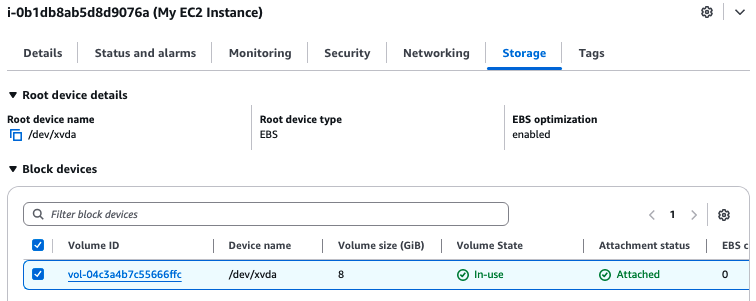
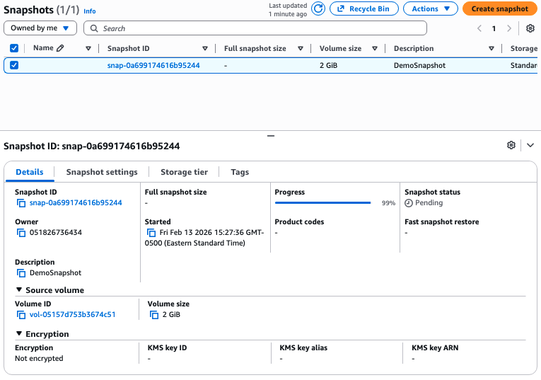
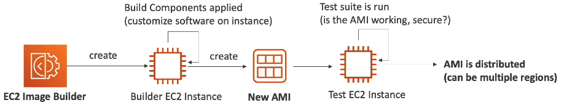
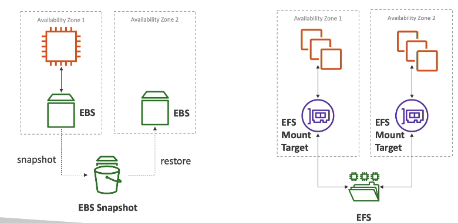
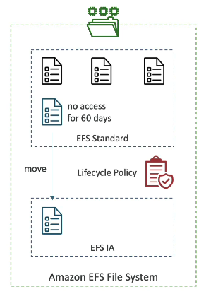

The goal of EC2 instance storage  is to persist data, even after the termination (deletion) of instances.

#### Elastic Block Store

The most important EC2 instance storage service is **EBS** (Elastic Block Store). An **EBS Volume** is a **network drive** you can attach to running EC2 instances. This means that its not storage in the machine as the EC2 instance, it's actually distributed storage bound an single AZ, accessible to the instance over the AZ's network.

Some features of EBS volumes
- Most types can only be attached to one EC2 instance, but some select types have EBS Multi-Attach, but that is beyond the scope of this course. One EC2 instance can however have many EBS Volumes attached to it of any type.
- Can be detached from one instance to be re-attached to another, great for failovers
- Locked to an AZ
- Since its a network drive, there is some latency in IO
- Has a provisioned capacity (size in GB, and IO Operations/s (also know as IOPS))
	- Note: IOPS is not about how many bytes of data you can read or write per second that is throughput, its out how many simultaneous requests for data reads/writes the volume can handle 
It's about how many simultaneous requests for data reads & writes the solution can handle.
- Can be configured to be deleted when the attached EC2 instance is terminated
	- Root EBS volume (this first one attached to a given instance) is deleted on termination by default
	- Any other EBS volume is NOT deleted on termination by default

If we check our instance from the [EC2](3.%20AWS%20EC2.md) section, we'll see in the *Storage* tab that it already has an 8GB EBS volume that was attached to it by default

Let's create a new volume to check out the process. Click "create volume" in EC2 > Volumes. We'll need to fill out the following
- Volume type: each have different storage options, IOPS, latency, and costs. We'll choose a General Purposed SSD (gp3).
- Size: GiB the volume can store. We'll choose 2GiB.
- IOPS: only configurable for some volume types. We'll leave the default of 3000.
- AZ: which AZ the volume is locked to. We'll choose us-east-1c, consistent with the EC2 instance. Always check the AZ of the instance you intend to attach to.
- Throughput: We'll leave the default of 125 MiB/s
- Snapshot ID (optional): you can take snapshots of EBS volumes to recreate them in different AZs (since you can't move them). We don't need this right now.

Then we can click on the volume, click "Actions" > "Attached Volume" and choose our instance. Note that the instance won't appear to attach to if its not running or stopped, if the instance is terminated thats why it won't show.

We just mentioned earlier that volumes can have **EBS Snapshots**. Snapshots are just backups of EBS Volumes at a some point in time. Snapshots have the following features:
- Snapshots can be created while still attached to an EC2 instance, but its recommended to detach them before backup to make sure everything is clean on the volume (i.e. there are no more pending writes).
- We can copy snapshots across AZs or even Regions, to leverage EBS across global infrastructure
- The snapshot archive can be used to move snapshots into before reattaching to another instance for a 75% discount, but its takes 24/72 hours to restore/reattach them.
- The recycling bin for EBS Snapshots can be setup to create rules to retain deleted snapshots so you can recover them after accidental deletion, like leaving deleted snapshots in the bin for some amount of time from 1 day to 1 year before permanent deletion.

Let's create a snapshot of the volume we just created. Within the volume Click "Actions" > "Create snapshot", and give the snapshot a description to identify it. Then we can see the snapshot in the *Snapshots* page.

From "Actions" in the *Snapshot* page, we have actions available to us including copying over to another AZ/region, or to create a new EBS volume from the snapshot.

#### Personal AMIs

Recall that AMIs are Amazon Machines Images, which is the image from which the instance was created with custom OS & software too. Customizing your own an AMI allows for a faster configuration/boot time because all the software we need is already there. We can create custom AMIs from EC2 instances, built for a specific region (but can be copied across regions).

Earlier to launch our first instance, we used a *Public AMI*, but we can also create these *Personal AMIs*, or find AMIs on the *AWS AMI Marketplace* which you can buy or sell.

The process of creating/using a custom AMI is as follows:
- Start an EC2 instance and customize it
- Stop the instance (for data integrity, avoids pending writes)
- Build an AMI (also creates EBS snapshots to go with the AMI)
- Launch new instances from the AMI

#### EC2 Image Builder

The **EC2 Image Builder** is used to automate the creation of VMs or container images. This means you can automate the creation, maintenance, validation, and testing of EC2 AMIs. Part of this automation means that Image Builder can be run on a schedule. Image builder itself is free, but you pay for the instances it creates.

It works by creating its own EC2 Instance called a *Builder EC2 Instance* that builds components and customizes software (e.g. install some files, delete files, etc.) into a new AMI. Then it optionally creates a *Test EC2 Instance* from the AMI to run tests. Finally, the AMI is distributed to multiple regions (image builder itself is regional).

#### EC2 Instance Store

Because EBS volumes are network drives, they are limited in their performance at a certain scale. **EC2 Instance Store** overcomes this with a high performance (better IOPS and throughput) hardware disk that is actually physically attached to the instance. This does mean though it does not have the ability to disable deletion on instance termination, the data is ephemeral.  This makes them good as a cache or buffer.. There is inherent risk of data loss in that if the instance fails, so does the instance store, so backups and restoration are important to manage.

#### Elastic File System

**EFS** (Elastic File System) is a managed network file system (NFS) that can be mounted on hundreds of EC2 instances at a time. This scale is much larger than EBS multi-attach. 
- Only works with Linux instances
- Unlike EBS, is multi-AZ (still in one region though)
- Much more expensive than EBS
- Pay per use, unlike EBS where you reserve storage capacity

Here's a diagram to compare EBS vs. EFS

EFS has a special **storage class** called **EFS-IA** (EFS Infrequent Access). This is a storage class that is cost-optimized for files not read or written to often. It can provide up to a 92% discount compared to EFS Standard. When enabled, files will be automatically moved from EFS Standard to EFS-IA based on when they were last accessed, determined by a **lifecycle policy**. It is best practice to always use this, there's no drawback its just a cost optimization

#### Third Party File Systems

**Amazon FSx** allows you to launch 3rd party high performance file systems, if you don't want to use EFS or S3 (will cover that later). Its a fully managed service (i.e. PaaS, not IaaS). Offerings include FSx for Lustre, Windows File Server, and NetApp ONTAP.

FSx for Windows File Server is a fully managed, highly reliable and scalable Windows native shared file system. 
- For Windows machines only
- Built on Windows File Server
- Supports the SMB (Server Message Block) protocol and Windows NTFS (New Technology File System). 
- Integrates with Microsoft Active Directory.
- Can be accessed from AWS on on-prem infrastructure

FSx for Lustre is a fully managed scalable file storage for High Performance Computing (HPC).
- For Linux machines only
- Name Lustre derived from Linux + Cluster
- Scales to 100s of GB/s, millions of IOPS, sub-ms latencies
- Can be accessed from AWS on on-prem infrastructure