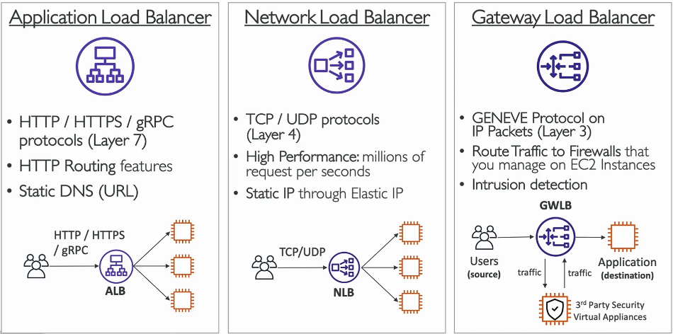
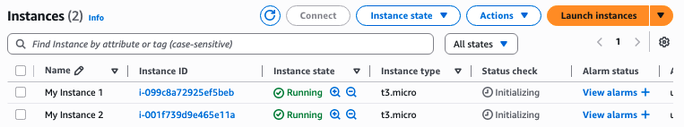

At scale, AWS helps enormously with scalability, high availability, elasticity, and agility. Lets give some technical definitions for these:

- **Scalability**: a system can adapt to handle greater load
	- Vertical Scalability: Adding compute/storage/throughput to an EC2 Instance. 
		- For example, scaling from a `t3.micro` Instance to a `t3.large` instance.
		- Non-distributed
		- Limited eventually by hardware
		- Scale all the way down to `t3.micro` with 0.5GB RAM, 1 vCPU, and all the way up to `u-12tb1.metal` with 12.3TB RAM, 448 vCPUs
	- Horizontal Scalability: Adding more EC2 Instances to scale
		- Implies a distributed system
		- Very common for modern web apps
		- Complexity of distributed nature eased by AWS
		- Scale out/in using auto scaling & load balancing 
- **High Availability** (HA): a system never goes down
	- Goal is to survive a data centre loss (e.g., power issues, natural disaster, etc.)
	- Means running a system in at least 2 AZs
- **Elasticity**: Similar to scalability, but in a more cloud-native sense. 
	- Implies there is some for of *auto scaling* so the system scales automatically based on load.
- **Agility**: new IT resources are only a click away, which means that you reduce the time to make those resources available to your developers from weeks to just minutes

Here, we introduce **ELBs (Elastic Load Balancers)** and **ASGs (Auto Scaling Groups)**, which are an often couple pair of EC2 features that together provide all these traits.
#### Load Balancing

**Load Balancers** are servers that forward network traffic to multiple downstream servers/instances. This is a key architecture in distributed compute for horizontal scale.
- Exposes a single point of access (DNS host name) to a distributed system
- Handles failures of downstream servers/instances
- Does health checks on instances
- Can provide HA across multiple zones
- Can perform SSL Termination for HTTPS
	- SSL Termination is the process of decrypting the HTTPS request. It is resource intensive so doing it once in the load balancer instead of for each instance is optimal, then the load balancer sends unencrypted requests over HTTP to each instance.

Load balancing is done in AWS using **Elastic Load Balancer**.
- AWS Guarantees it will be working
- AWS takes care of upgrades, maintenance, HA
- Minimal configuration needed to set it up
- 3 kinds of load balancers at various layers of abstraction in the [OSI model](https://en.wikipedia.org/wiki/OSI_model)
	- Application Load Balancer: for HTTP / HTTPS / gRPC (Layer 7 / Application Layer)
	- Network Load Balancer: ultra high performance, for TCP/UDP (Layer 4 / Transport Layer)
	- Gateway Load Balancer: GENEVE (works with IP packets) (Layer 3 / Network Layer)

> Note: you can set up your own load balancer with a custom EC2 instance, but its a lot more effort in terms of maintenance, integrations, etc.

Let's see how a load balancer works in practice. First lets launch 2 instances, and visit both public IPv4 addresses just to ensure they both work fine.

> Tip: you can launch multiples copies of the same instance at once, when launching theres a field "Number of Instances"

Then go to *Load Balancers*, and click "Create Load Balancer", then create an Application Load Balancer. We have to configure a few things:
- Load balancer name
- Scheme: internet facing (public IPs), or internal (private IPs). We'll choose internet facing.
- IP Address type: IPv4, Dualstack (IPV4 + IPv6), Dulastack without public IPv4 (private IPv4 + private/public IPv6). We'll choose IPv4.
- Availability Zones: Choose AZs within the region. We'll choose all `us-east-1` AZs for HA.
- Security Group: We'll create a new security group to only allow HTTP traffic
- Listeners & Routing: Configure the protocol/port (we'll leave HTTP on port 80), and which **target groups** (groups of EC2 instances) to forward traffic to.

Now if we go to the DNS name URL, if we repeatedly refresh the page, the text `Hello World from ip-<Public IPv4 Adress>.ec2.internal.com` will rotate between the IP of the two instances, showing we have successfully created a load balanced, distributed application.

#### Auto Scaling

Load on an application can change over time, prompting a need to automatically scale out/in based on load to match network traffic, and to optimize costs. We can leverage the fact that we can provision servers in the cloud very quickly do easily do this. In AWS, this is implemented in EC2 using **Auto Scaling Groups** (ASGs) to scale horizontally. The magic of ASGs is that they automatically configure new instances to a load balancer, and automatically replace unhealthy instances. ASGs essentially implement elasticity.

Let's now create an ASG connected to our ALB from earlier. In EC2, go to Auto Scaling Groups, and click "Create Auto Scaling Group". Configure as follows:
- Auto Scaling Group Name
- Launch Template: A reusable configuration that tells the ASG how to create instances. Looks very similar to configuration of launching an instance. We'll configure as we did to launch our EC2 instances before.
- Availability Zones: We'll select all AZs in `us-east-1` for HA.
- Load balancing: Attach a load balancer target group here. We'll choose our ALB from earlier
- Health Checks: Configure how we replace unhealthy instances. We'll turn this on.
- Group Size: the desired number of instances in the ASG. We'll set this to 2.
- Scaling: Set the minimum and maximum desired number of instances for the ASG. We'll set this at a min of 1, and a max of 4
- Automatic Scaling: Can be no scaling policies, or can be configured to scale based on a CloudWatch metric (i.e., scale based on live runtime data). We'll choose no scaling, since we don't have an app with the kind of variable load this make sense for.
	- It might initially seem like an ASG without scaling makes no sense. It's still extremely important, because it will do health checks and replace unhealthy instances to maintain our distributed system.

Now we can see our ASG, that automatically launched 2 new instances, per our desired capacity

Now if we terminate one of these instances, the ASG will spin up a new one on its own!

There are different ways to decide when to scale. These are called **scaling strategies**
- **Manual Scaling**: Update the size of an ASG manually
- **Dynamic Scaling**: Respond to changing demand
	- **Simple / Set Scaling**
		- Example: When a CloudWatch alarm is trigger (example CPU > 70%), then add 2 units
		- Example: When a CloudWatch alarm is trigger (example CPU < 30%), then remove 1 unit
	- **Target Tracking Scaling**
		- Example: I want the average ASG CPU to stay at around 40%
	- **Scheduled Scaling :** Anticipate a scaling based on known usage patters
		- Example: increase the min. capacity to 10 at 5pm on Fridays
	- **Predictive Scaling**: Uses ML to predict future traffic ahead of time, based on past traffic. Automatically provisions the right number of EC2 instances in advance. Useful when load is predictable time based patterns.