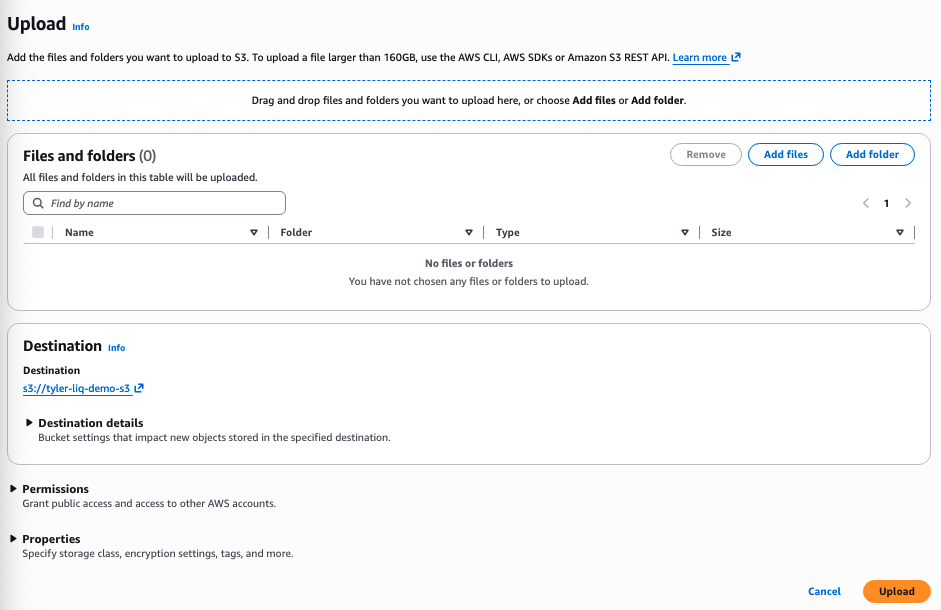
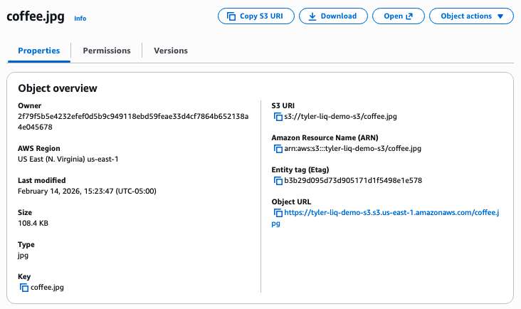
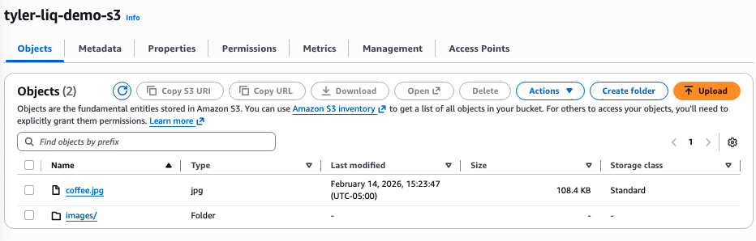
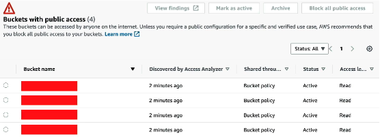
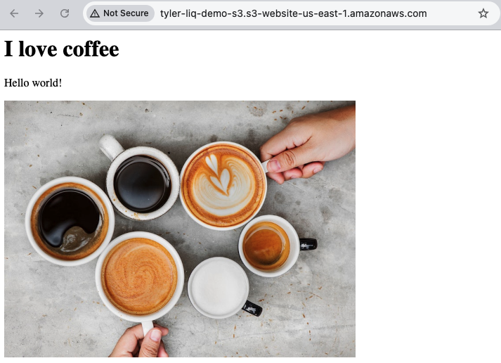
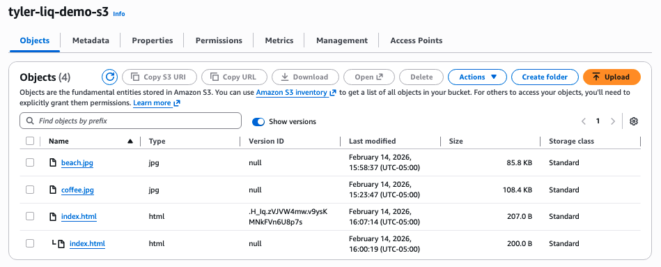
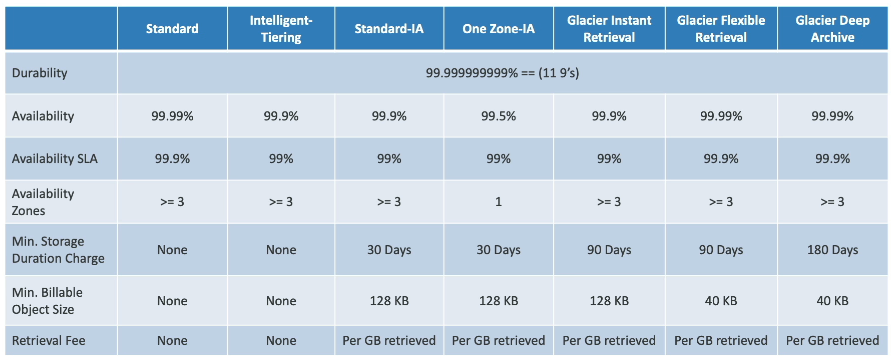

#### S3 Basics

**AWS S3 (Simple Storage Service)** is advertised as "infinitely scaling storage". Its widely used over the internet by websites and services alike.

Core use cases include:
- Backup and Storage
- Disaster Recovery
- Archives
- Hybrid Cloud Storage
- Application Hosting
- Media Hosting
- Data lakes & big data analytics
- Software delivery
- Static Website

The primary mechanism by which we interact with S3 is through **Buckets**. Buckets act as a root directory in a file system, and they store objects (files). 
- They have a globally unique name (across regions and all AWS accounts on the market)
- Defined at the region 
- Naming convention
	- Np uppercase, no underscore
	- 3-63 chars long
	- Not an IP
	- Must start with lowercase letter or number
	- Must NOT start with prefix  `xn--`
	- Must NOT end with suffix `-s3alias`

**Objects** are just files that have a key that point to the file data
- Objects are located by the URL the URL: `s3://<bucket>/<key>`
- The key pointing to the file data is composed of a prefix that are like a file system directory, and an object name which is like the file name in a file system directory. Remember that S3 is a key-value store, event the UI looks like a file system and the URL looks like one there are no directories like EFS.
- Max object size is 5TB
- Objects larger than 5GB must use multi-part upload
- Can have a list of metadata key-value pairs for the object itself as 
- Can have tags
- Might have a version ID if versioning is enabled


Let's create a bucket. Click "Create a Bucket" in S3. Configure as follows:
- Bucket Type: General Purpose vs Directory (for low latency use cases)
- Bucket name:  globally unique name across all accounts!
- Public Access Settings: Override bucket policies and block public access from ever leaking for this bucket, to prevent someone from accidentally leaking data never meant to be allowed to be public at runtime.

We can then upload objects to our bucket through the management console.



Uploading a file to the bucket, we can then open it from the management console with the "Open button" to view it with a signed URL, but the public URL wont work and will give an error.



We can also make a folder `/images`, and upload another photo in there.




#### Security

We can implement security in S3 in a few different ways:
- **User-Based**: IAM policies decide which API calls should be allowed for a specific IAM user
- **Resource-Based**: 
	- **Bucket Policies**: Bucket wide rules from the S3 console to allow access cross account, most commonly used.
	- **Object Access Control List (ACL)**: fine grain permissions filtering for specific objects (can be disabled).
	- **Bucket Access Control List**: permissions filtering for specific buckets, not very common (can be disabled).

> Note: an IAM principal can access an S3 object if: (The User-Based permissions ALLOW it OR the Resource-Based permission ALLOWS it) it AND theres no explicit DENY

A Bucket Policy decides who can access the bucket, this could be for the public, or for other accounts (Cross Account). 

Let's setup a bucket policy to make our object from earlier public. First we need to disable the global override blocking public access from the create bucket config from earlier. Do this in the "Permissions" tab of the bucket.

In the same tab, lets edit the Bucket Policy. Let's create the JSON for the bucket policy with the [AWS Policy Generator](https://awspolicygen.s3.amazonaws.com/policygen.html). Bucket Policies are JSON based policies with the follow schema:
- `Resource`: buckets and objects
- `Effect`: Allow | Deny
- `Principal` the account or user to apply the policy to
- `Action`: Set of APIS to apply the effect to

To make the bucket public, we want:

```JSON
{
  "Version": "2012-10-17",
  "Statement": [
    {
      "Sid": "Statement1",
      "Effect": "Allow",
      "Principal": "*",
      "Action": [
        "s3:GetObject"
      ],
      "Resource": "arn:aws:s3:::tyler-liq-demo-s3/*"
    }
  ]
}
```

There's also something called **IAM Access Analyzer for S3** to ensure that only intended people have access to S3 buckets (i.e., IAM and bucket policies are properly configured as you think).



#### Static Website Hosting

S3 Can host static websites and have them accessible on the internet, as long as the bucket is made public through a bucket policy. The URL will be `http://<bucket-name>.s3-website.aws-region.amazonaws.com`.

In the "Properties" tab for the bucket, go to `Static Website Hosting`, Click "Edit", and point the bucket to server `index.html`. Then upload `index.html` and we can check it out at the URL shown in the `Static Website Hosting` section `http://tyler-liq-demo-s3.s3-website-us-east-1.amazonaws.com/`.



#### Versioning

You can version files in S3 if enabled at the bucket level. It works by incrementing the version number of the file if you re-upload it under the same key. Its best practice to use this, as it protects against unintended deletes because you can restore back to any version.

> Note: any file not versioned prior to enabling versioning will have version `null`

> Note: Suspending versioning does not delete previous versions, its a safe operation

Enable versioning in the "Properties" tab under `Bucket Versioning`. Click "Edit" and then enable bucket versioning. Now we can update our website by uploading a new `index.html` and see versioned files by enabling the toggle "Show versions" for the bucket



With versioning enabled, we can delete the newer version of `index.html` to get back out old website. when we do this, we are permanently deleting this version. Contrastingly, with "Show versions" toggled off, deleting an object only adds a delete marker and updates the version, but the original version is still there if we toggle back to show versions. 

#### Replication

To do replication, we must enable versioning in both the source and target buckets. The buckets may or may not be in different regions, and different AWS accounts. Copying occurs asynchronously, and only works if buckets have proper IAM R/W permissions

Some use cases of replication
- Cross Region Replication: Compliance, Lower Latency Access, Replication Across Accounts
- Same Region Replication: Log Aggregation, Environment Separation (Prod vs. Test Accounts)

#### Storage Classes

Objects can belong to one of many different storage classes that can be modified either manually, or with Lifecycle Configurations to move automatically between the most optimal storage class.

The goal of different storage classes is to trade off between the following properties:
- **Durability**: represents how often AWS loses an object
	- S3 is Designed for 99.99999999999% durability, implying you lose 1 object of 10 million every 10,000 years. All storage classes have this high durability.
- **Availability**: represents how readily available the objects APIs are
	- Varies between object classes.

- **S3 Standard**
	- 99.99% availability = not available for 53 minutes per year
	- Use for frequently accessed data
	- Low latency and high throughput
	- Sustain 2 concurrent facility failures (data replicated redundantly across at least 3 AZs)
	- Use cases: Big data analytics, mobile and gaming applications, content distribution
- **S3 Standard-Infrequent Access**
	- For data that less less frequently accessed, but still needs rapid access when needed
	- Cheaper than S3 Standard General Purpose
	- 99.9% availability = not available for about 9 hours of the year
	- Min 30 storage during of 30 days
	- Use cases: Disaster recovery, backups
- **S3 One Zone-Infrequent Access**
	- For data that less less frequently accessed, but still needs rapid access when needed
	- Cheaper than S3 Standard General Purpose
	- High durability (11 9's) but only in a single AZ, so if that AZ goes down so does the bucket and the data is gone.
	- 99.5% Availability = not available for about 2 days of the year
	- Min 30 storage during of 30 days
	- Use cases: Secondary backup copies, data you can recreate
- **S3 Glacier Instant Retrieval**
	- Low-cost object storage meant for archiving / back
	- Priced for storage + object retrieval cost
	- Sub ms retrieval latency
	- Great for data accessed once per quarter, min storage duration of 90 days
- **S3 Glacier Flexible Retrieval**
	- Low-cost object storage meant for archiving / back
	- Priced for storage + object retrieval cost
	- 3 different tiers
		- Expedited: 1-5 minute retrieval time(most expensive)
		- Standard: 3-5 hour retrieval time(cheaper)
		- Bulk: 5-12 hour retrieval time(free)
	- Min storage duration of 90 days
- **S3 Glacier Deep Archive**
	- Low-cost object storage meant for archiving / back
	- Priced for storage + object retrieval cost
	- 2 different tiers
		- Standard: 12 hour retrieval time
		- Bulk: 48 hour retrieval time
	- Minimum storage duration of 180 days
- **S3 Intelligent Tiering**
	- Automatically move objects between access tiers based on usage
	- Designed for data with changing or unknown access patters
	- Incurs a small monthly monitoring and auto-tiering fee



We can also create a **Lifecycle Rules** for a bucket to automatically schedule move its objects between tiers, schedule deleting them, and other object lifecycle activities.

There is one more storage class that is a bit different than the others. **S3 Express One Zone** is high performance but for a single AZ.
- Objects are stored in a directory bucket instead of a general purpose bucket
- Can handle 100,000s requests/s with single-digit ms latency
- Up to 10x better performance than S3 standard for 50% of the cost
- Still 11 9's of durability, but 99.5% Availability = not available for about 2 days of the year
- Co-locating your storage and compute resources in the same AZ can further reduce latency
- Use cases: data-intensive apps, AI & ML training, financial modelling, media processing, HPC
- Best integrated with data services like SageMaker Model Training, Athena, EMR, Glue, and others.

#### Encryption

We can also encrypt S3 objects using encryption keys, and AWS provides mechanisms to control who can decrypt them. We can use a bucket policy to force objects to be encrypted on upload. This encryption occurs on the server-side, and is always enabled by default. It is also possible to do client side encryption, where the client encrypts the data before uploading to S3.

#### Storage Gateway

AWS is pushing for hybrid cloud, for a variety of reasons, like cloud migrations, security or compliance requirements, or IT strategy. But the issue is that S3 is a proprietary technology (unlike EFS), so how can we expose the S3 data on-prem? We solve this issue with **AWS Storage Gateway**. 