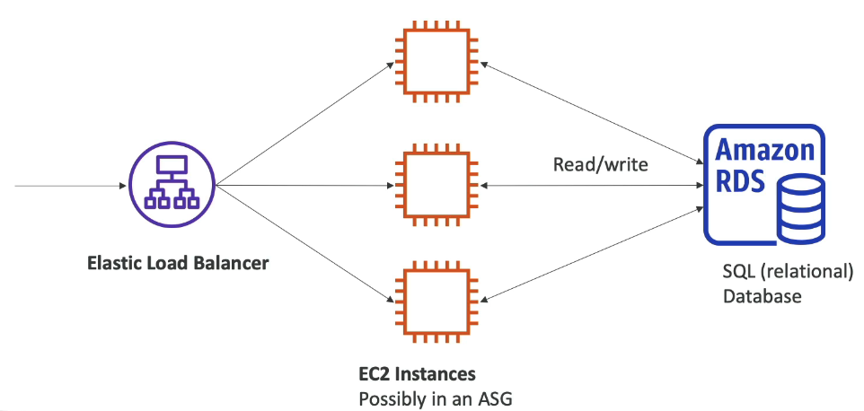
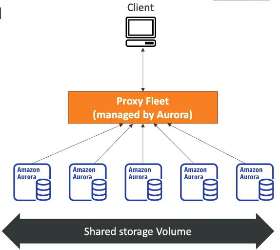
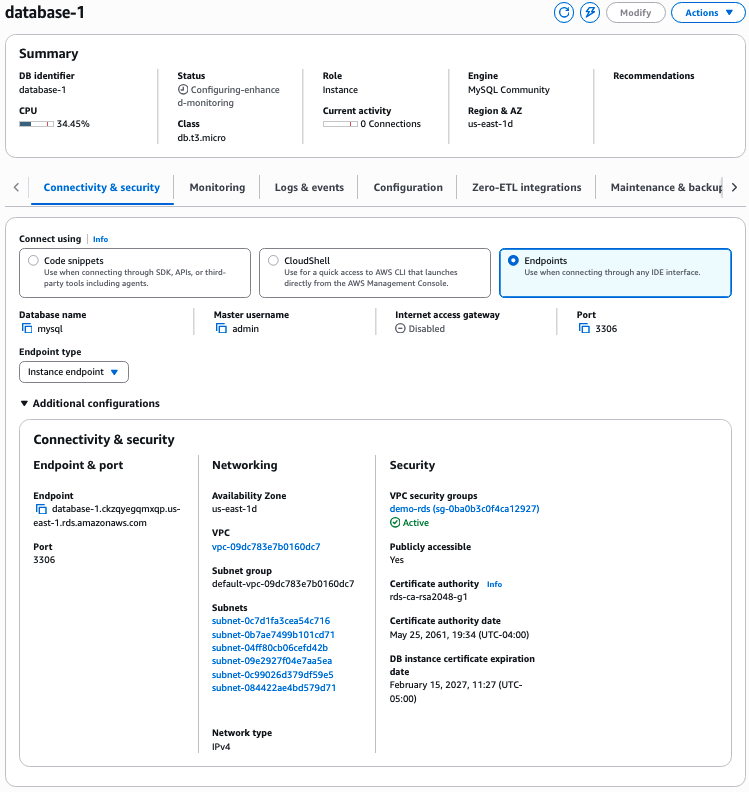
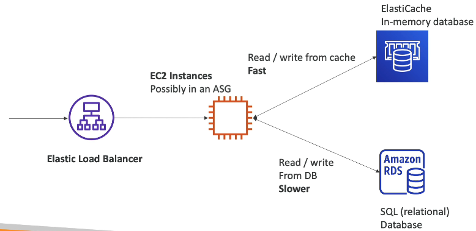
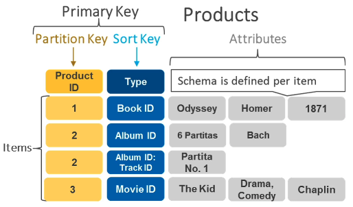
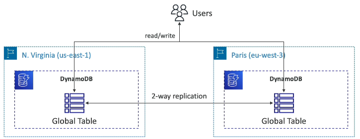

AWS Databases are **managed**, meaning they act more as PaaS than IaaS. You can still run your own database on an EC2 instance, but then you have to handle the resiliency, backups, patching the OS, HA, fault tolerance, scaling, monitoring/alerting, scaling

#### Key Relational Databases

**AWS RDS (Relational Database Service)**
- Built on top of EBS (except Aurora)
- Available in many SQL dialects
	- Postgres
	- MySQL
	- Oracle
	- MariaDB
	- SQL Server
	- IBM DB2
	- Aurora (AWS Proprietary)
- Is a managed RDBMS
	- Automated provisioning, OS patching
	- Continuous backups and restore to specific timestamp
	- Monitoring dashboards
	- Read replicas for improved read performance
	- Multi AZ setup for disaster recovery (DR)
	- Scaling capability (vertical and horizontal)
	- Storage Backed By EBS
- Although; can't SSH into managed machines

**AWS Aurora** is a proprietary technology (not open sourced) by AWS. It is a cloud optimized version of either PostgreSQL or MySQL that provides either a 3x or 5x performance optimization for each respectively. Aurora storage automatically grows in increments of 10GB up to 256TB. You pay for these features over RDS without Aurora 20% more.

**AWS Aurora Serverless** is another option that does auto-scaling of database instances, meaning you don't have to plan capacity at all so its less management overhead. You pay per second, and it can be more cost effective. Designed for intermittent or unpredictable loads.

Let's provision a database. In the Aurora and RDS Console, click on "Databases", then "Create database". Configure as follows
- Engine options: what RDBMS engine you want, we'll choose MySQL
- Engine version: the version of the RDBMS engine, we'll choose the latest MySQL version
- Templates: Production, Test, or Free Tier. We'll choose free tier. Free Tier does not have access to redundancy across a multi-AZ DB instance deployment, and also has lower availability.
- Credentials Settings: Setup username/password and encryption, and optionally IAM auth. You can set up managed secrets with **AWS Secrets Manager**, however we'll choose self managed
- Instance Configuration: Choose the instance type (there are special instance types for databases). We'll choose `db.t3.micro`.
- Storage: Specify the storage volume (same as EBS volumes), how much storage it has, and auto scaling that storage up to a specified amount of GB.
- Connectivity: Network & VPC Settings, and you can automatically connect EC2 compute resources. All we'll change is to choose yes for public access so we can use the public IP, and we'll create a new security group to allow TCP traffic on the default port of 3306

RDS Databases also have a number of choices for deployment
- **Read Replicas**: Scale the read workload of your DB, with multiple replicas to read from. Create up to 15 read replicas for read heavy systems (less replicas for some RDBMSs). You only need to write to the original DB, writes to replicas are managed.
- **Multi-AZ**: Failover in case of AZ outages in 1 other AZ, for HA. Failovers are triggered automatically, the failover DB is not accessible until a failure occurs. Writes to the failover DB are also managed like read replicas.
- **Multi-Region (Read Replicas)**: Same as read replicas but replicas are in other regions. Useful for multi region apps, each region reads from the DB in their respective region, but all writes still go to the main DB. Provides HA but also local performance for global apps. Cost incurred for cross-region replications.

#### Key Non-Relational Databases

**ElastiCache** is a managed in-memory Redis/Memcached database. These are helpful to reduce load off DBs with read intensive workloads, they are highly performant with low latency.

**DynamoDB** is a fully managed custom AWS Key-Value Database, highly available across 3 AZs. Its a distributed, serverless database (i.e., no manual provisioning needed). The NoSQL nature of DynamoDB means its flexible, values don't have to have the same attributes/schema. It auto-scales up to millions of requests/s, trillions of rows, and 100s of TBs of storage, all with single-digit ms latency. It also has Standard and IA classes, like S3 to optimize costs. 

In DynamoDB, every table has a **primary key** that uniquely identifies each item. This primary key can be simple or composite. With a **simple primary key**, you only have a **partition key**, which DynamoDB uses as input to a hash function to decide where the item is stored internally. When you include a **sort key**, you create a **composite primary key**: the partition key still determines the storage partition, and all items with the same partition key are kept together and ordered by the sort key. This lets you efficiently organize and retrieve items within a group based on their sort key values. For example, fetching all orders for a given customer in date order, without scanning the entire table. Because the partition key is hashed and distributed across storage nodes, it supports DynamoDB’s horizontal scalability, and the optional sort key adds the ability to efficiently perform range or ordered queries inside each partition.

DynamoDB also has its own in-memory cache, **DynamoDB Accelerator (DAX)**. DAX Has 10x latency performance over DynamoDB on its own. The only different from Elasticache (for this course) is that it integrates with DynamoDB.

Let's create a DynamoDB table. Notice that we create a table and not a database/server because DynamoDB is fully managed, provisioning is abstracted away. Click "Create table", and let's configure the DB table:
- Table Name
- Partition Key: the name of the column for the partition key. We'll do 
- Sort Key: for creating composite keys, we wont use this

From the DynamoDB console, we can create items in our tables without and query language or code.

One more feature of DynamoDB is **Global Tables**. Global Tables allow you to create a single logical DynamoDB table that is replicated across multiple AWS regions. Each region has its own fully active copy of the table, and DynamoDB automatically manages multi-region replication between them. It is an **active-active** replication unlike RDS, so you read/write to any region (reads and write both to the nearest region) and replication is automatically managed.

#### Other Databases & Analytics Services

Other Managed Databases & Related Analytics Services include the following:
- **Redshift**: a Postgres based RDBMS, that is not used for Online Transaction Processing (OLTP) but instead Online Analytical Processing (OLAP), which is good for analytics and data warehousing.
	- Can holds tons of data, but read/writes are slower. You can only load data once every hour
	- 10x better performance than other data warehouses
	- Scales to PBs of data
	- Columnar storage instead of row based
	- Massively Parallel Query Execution (MPP) for HA
	- Query Editor to make SQL queries easy
	- Pay as you go based on instances provisioned
	- Has serverless for auto-scaling and abstraction of provisioning
	- Integrates with BI Tools like AWS Quicksight and Tableau
	- Use cases: reporting, dashboards, real-time analytics
- **Elastic MapReduce (EMR)**: for creating Hadoop clusters, for analyzing and processing massive amounts of data
	- Clusters can have hundreds of EC2 instances
	- Also supports Spark, HBase, Presto, Flink
	- Provisions, configures, and scales all its instances automatically
	- Use cases: data processing, ML, big data
- **Amazon Athena**: A serverless query service to perform analytics against S3 objects
	- Query S3 objects with SQL
	- Supports queries against CSV, JSON, and other more data efficient formats stored within S3
	- Costs $5/TB of data scanned
	- Use compressed or columnar data for cost-savings (less scanned data)
	- Use cases: BI, analytics, logging
- **QuickSight**: Serverless ML-powered BI service to create interactive dashboards
	- Fast, automatic scaling, embeddable
	- Priced per-session
	- Integrates with RDS, Aurora, Athena, Redshift, S3
	- Use cases: BI, analytics, 
- **DocumentDB**: a cloud-native AWS implementation of MongoDB (like Aurora is the AWS implementation of MySQL / PostgreSQL)
	- MongoDB is used to store, query, and index JSON data
	- Full managed, HA with replication across 3 AZs
	- Automatically grows in increments of 10GB, and scales to workloads of millions of RPS
- **Neptune**: Fully managed graph database
	- HA with replicas across 3 AZs, with up to 15 read replicas
	- Millisecond level latency for billions of relations
	- Use cases: social networks, knowledge graphs, recommendation engines
- **Timestream**: Fully managed, serverless time series database
	- Auto scales up/down
	- Store and analyze trillions of events per day
	- 1000s of times faster and 10% the cost of RDBMSs
	- Built in time series analytics functions
- **Managed Blockchain**: Build apps where multiple parties can execute transactions without the need for a trusted, central authority.
	- Allows joining public blockchain networks, or creating a scalable private network
	- Compatible with both the Ethereum and Hyperledger Fabric frameworks
- **Glue**: Managed, serverless ETL Service
	- For preparing and transforming data for analytics
	- Integrates with other AWS databases and S3
- **Database Migration Service (DMS)**: For moving data from a source DB to a target DB
	- Quickly and securely migrate databases
	- Resilient and self-healing
	- Source DB remains available during migration
	- Supports homogenous migration and heterogeneous migrations (including SQL to NoSQL)