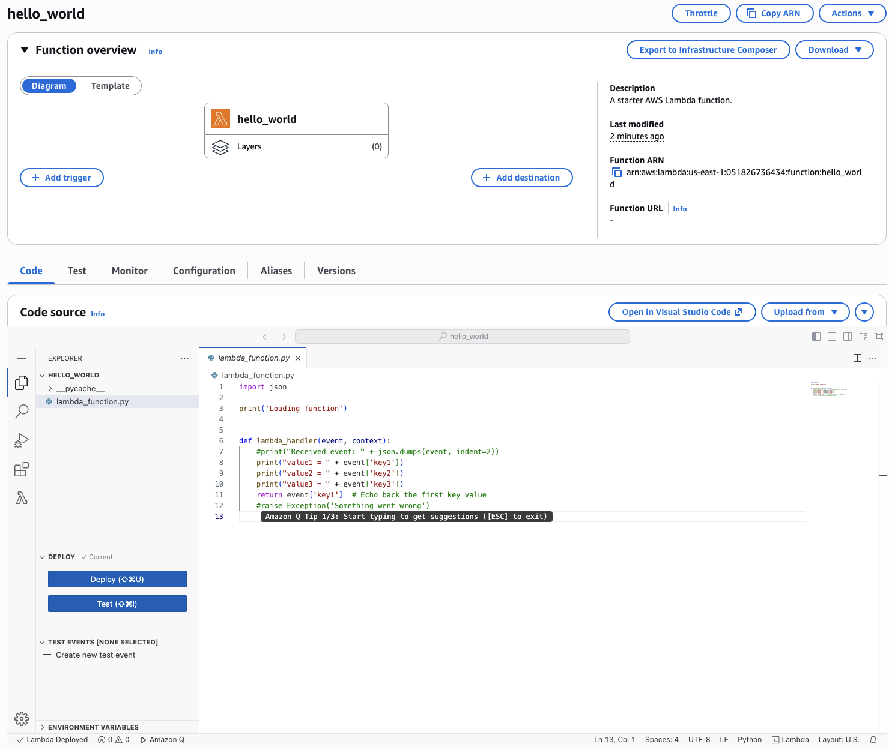
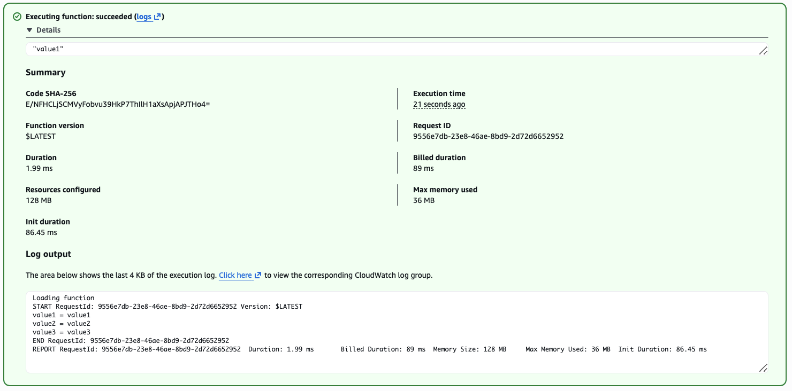

#### Containerization Services

**Elastic Container Service (ECS)** helps scale Docker contains up/down in seconds.
- Provision and maintain the EC2 instance yourself, ECS manages stopping and starting containers
- Integrates with ALB

**Fargate** is a managed way to launch Docker containers on AWS
- You don't provision EC2 instances yourself, it's serverless
- Auto-scaling based on CPU/RAM usage

**Elastic Container Registry (ECR)** is like Docker Hub, but is a private registry for ECS and Fargate to access your Docker images.

**Elastic Kubernetes Service (EKS)** allows launched managed Kubernetes clusters on AWS
- Containers can be hosted on EC2 instances managed by ECS, or serverlessly on Fargate

#### Functions-as-a-Server

**AWS Lambda** is Amazon's serverless "Function as a Service" (FaaS). We don't manage servers at all, just the functions that run on them. Lambda functions are designed for shorter execution, to run on-demand with automated scaling as needed.
- Event driven architecture: functions only get invoked when needed, Lambda is reactive
- Integrates with many programming languages natively, and many more through the custom runtime API
- Priced per request and compute time
- Generous free tier, and very cheap overall: 1M free requests and 400K GB\*s of compute time. After that, $0.20/million requests, and $1.00/600K GB\*s after (1GB\*s means running the function for 1 second with 1 GB RAM)
- Up to 10GB RAM per function. Increasing RAM also improves CPU and network.
- Supports containers through the Lambda Runtime API
- Invocation time maxes out at 15 minutes, so not for long running jobs
- **Cold Starts**: When a Lambda function hasn’t been used recently or needs to scale up, AWS must initialize a new execution environment before running it. This causes extra startup latency. Subsequent “warm” invocations are much faster because the environment is reused.

Let's setup a Lambda function. Go to Lambda and Click "Create function". We'll configure from a blueprint instead of from scratch:
- Blueprint: A pre-configured template to start from. We'll choose the Hello World function for Python 3.12
- Function Name: `hello_world`
- Runtime: Options include .NET, Java, Node, Python, Ruby, or OS-only runtime for other/custom languages.
- Execution Role: Optionally include an IAM role (as you would for an EC2 instance). We'll choose to create a new role with basic lambda permission
- Lambda Function code: the actual function to run, we'll leave the sample code

The Lambda dashboard also actually has a VSCode editor built in to change the function if you want as well.

We can then create test events to make sure our function works properly. In the "Test" tab, click "Create new Event", there's already a JSON payload that will test the default `lambda_handler` Python code we setup earlier, and then click "Test" and we'll be shown some output logs.

#### Other Compute Services

Some other compute oriented services to know about include:
- **API Gateway**: a higher level proxy than ELB's ALB
	- Managed features include caching and rate limiting, auth, security etc.
	- Can be used as a proxy to expose Lambada functions as HTTP APIs
	- Supports Both RESTful and WebSocket APIs
	- More expensive than an ALB
- **Batch**: Fully managed batch processing at scale. Batch jobs are jobs with defined start and end times, as opposed to streaming jobs that are continuous that are always running.
	- Efficiently run 100,00s of batch jobs
	- Dynamically provisions EC2 instances or Spot instances
	- Submit or schedule batch jobs into the batch queue and the service does the rest
	- Batch jobs are just a Docker image and test definition that are run on ECS
	- No max time for invocations, unlike Lambda great for long running jobs
- **LightSail**: An extremely simple service that provides many functions from previous services in this course (EC2, EBS, ELB, RDS, and more). Best for non-technical people with little to no cloud experience
	- Has templates for common tech stacks (e.g., LAMP, MEAN, etc.)
	- Has templates for CMS Websites (e.g., WordPress)
	- Has HA, but no auto-scaling, limited AWS integrations