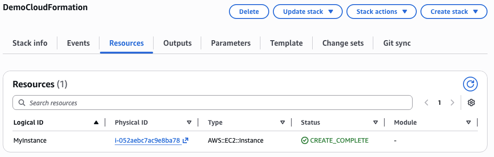

#### Infrastructure-as-Code

**AWS CloudFormation** is a declarative Infrastructure-as-Code (IaC) for AWS
- Removes the need to manually create resources as we have in this course so far
- Allows code reviews of IaC which is a good system for collaboration
- Resources are tagged with an ID for easy cost management
- Create templates, or leverage existing ones, and deploy into a stack
- Generates architecture visualization diagrams for templates
- Custom resources can be created for AWS resources that aren't supported, although most resources are supported
- The service itself is free, but you pay for the resources it creates

Let's create our first CloudFormation Stack, by clicking "Create Stack" and uploading the template:

```yaml
---
Resources:
  MyInstance:
    Type: AWS::EC2::Instance
    Properties:
      AvailabilityZone: us-east-1a
      ImageId: ami-0453ec754f44f9a4a
      InstanceType: t3.micro
```

And now CloudFormation will create the instance we declared in our code



Also now when we delete the stack, all its resources get deleted automatically too (unless a `DeletionPolicy` defined in the IaC specifies otherwise.)

An alternate IaC choice is the **AWS Cloud Development Kit (CDK)**. It is built on top of CloudFormation that allows for IaC through programming languages that then compiled into the underlying CloudFormation templates in JSON/YAML. Unlike the SDK, its primary purpose is declaratively creating resources with IaC instead of interacting with in individual resource APIs imperatively.

#### Platform-as-a-Service

We've seen some managed services already like Lambda, and RDS, but not a comprehensive one that ties together all the common infrastructure services together. **Elastic Beanstalk** is a comprehensive managed PaaS that creates the basic infrastructure to scale most apps, with EC2 instances in an ASG behind an ALB connected to whatever managed AWS DBs you need (RDS and ElastiCache most commonly). Being a PaaS, it also comes with monitoring thorough CloudWatch metrics.
- A lot easier to use because all the infrastructure is in one view instead of across different views in the management console, and is more developer-centric. The primary focus is getting an app launched quickly, not dealing with infrastructure. 
- 3 architecture models based on CloudFormation templates
	- Single instance deployment
	- ALB + ASG
	- only ASG, no ALB

#### CI/CD

A number of CI/CD tools exist on AWS:
- **CodeDeploy**: automatic deployments for EC2 instances, on-prem, or hybrid
- **CodeCommit**: GitHub alternative (Git based SCM) with AWS integrations
- **CodeBuild**: Test, package, and build code in AWS
- **CodePipeline**: Jenkins alternative with AWS integrations
- **CodeArtifact**: JFrog alternative with AWS integrations

#### Systems Management

**AWS SSM (Systems Manager, formerly Simple Systems Manager)** helps with management of cloud resources for full cloud, on-prem or hybrid. It provides operational insights on the state of cloud resources. It works for Linux, Windows, macOS, and Raspberry Pi OS. We use SSM by installing an SSM agent on the systems we control, which is installed by default for some AMIs.

SSM Features include:
- Patching automations
- Run commands across fleets of servers
- Configuration and secrets store

The **SSM Session Manager** allows starting a secure shell for on-prem or cloud instances without SSH. No SSH Keys, no need to open port 22, instead connect through the session management service provided by the SSM agent installed on the instance.

The **SSM Parameter Store** is a secure storage for configurations and secrets.
- Can store API Keys, passwords, configurations, and more
- Based on serverless, scalable infrastructure
- Control access permissions with IAM
- Optional versioning and encryption