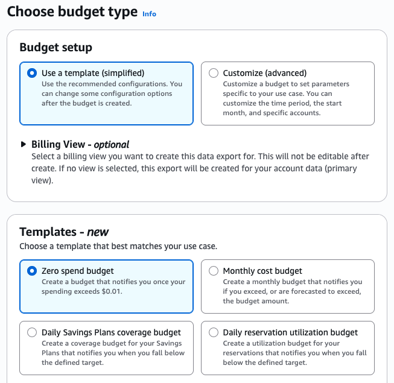
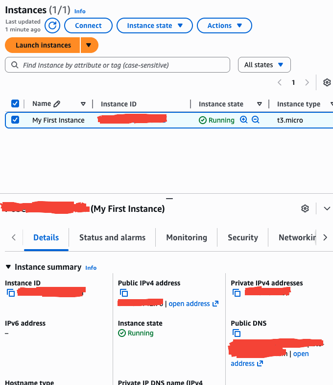
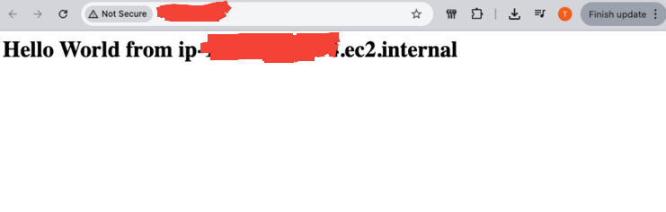
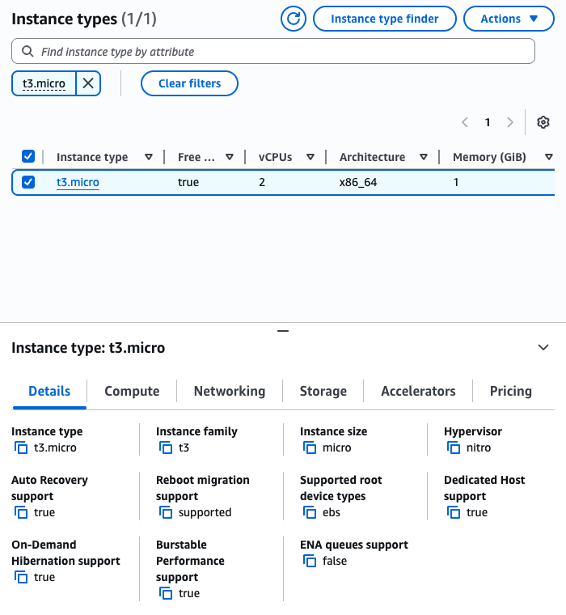
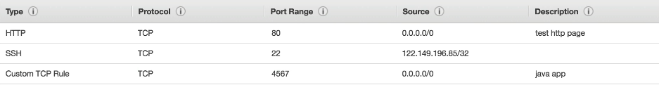
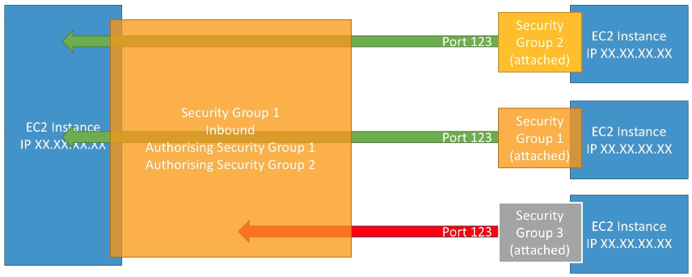
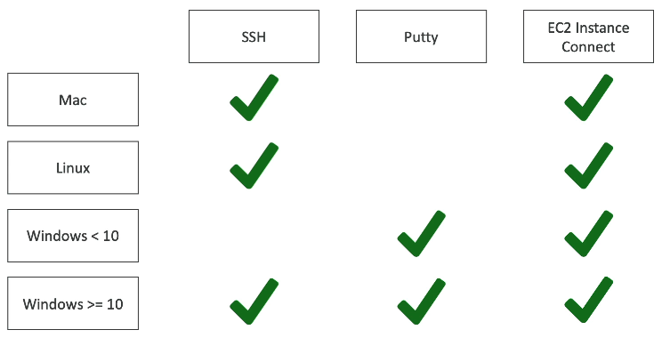
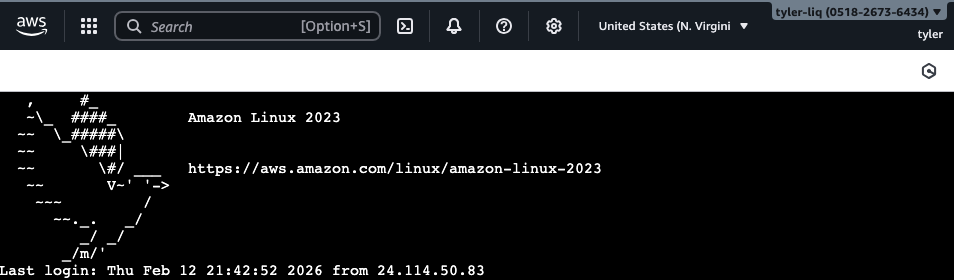
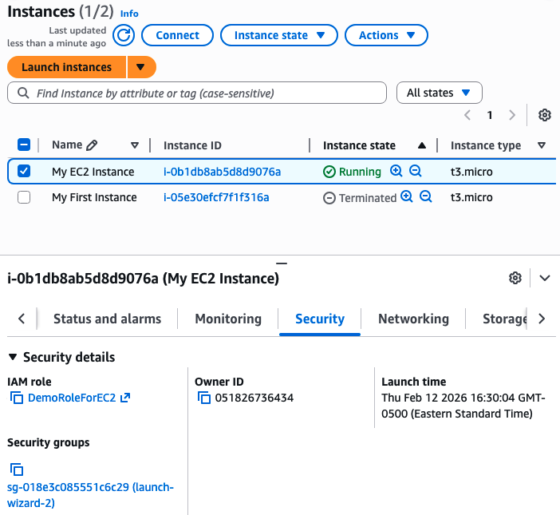
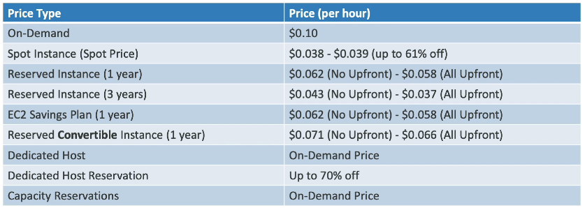

Given that we're going to start spending some money, lets first create a **budget** in **Billing and Cost Management** to notify us by email when we spend money on AWS. For now, lets set up a zero spend budget so as soon as $0.01 is spent and we use a service beyond its free tier we are aware. Free tier usage limits are also shown in Billing and Cost Management under *Free Tier*. We'll also set up a monthly $10/month budget too as good practice, although in this course we shouldn't need to spend any money if we are careful.



#### EC2 Basics

**EC2** (Elastic Compute Cloud) is one of AWS's most popular offerings. It is AWS's primary IaaS that allows renting virtual machines. EC2 works together with other services to provide scalable, highly available application deployments (we will cover all this in detail):
- EC2: Renting Virtual Machines
- EBS: Storing data on virtual drives
- ELB: Distributing load across machines
- ASG: Scaling services on demand

EC2 has many different sizing and configuration options to configure your VM.
- OS (Linux, Window, Mac)
- Compute Power & Number of Cores (CPU)
- Memory (RAM)
- Storage Space (network attached via EBS & EFS, hardware via EC2 Instance Store)
- Network Card: speed of the card, public IP
- Firewall rules: security group
- Bootstrap script: Configure the EC2 instance to run a script on ONLY its first launch to automate boot tasks run with the root user, via EC2 User Data
	- Install updates, or other software
	- Download files from the internet
	- Anything!

#### Launching an EC2 Instance

Launching an EC2 Instance requires configuring the following
- Name: a name for the instance.
- AMI: An Amazon Machine image a preconfigured OS template with pre-installed software. We'll choose the Amazon Linux 2023 kernel-6.1 AMI with 64-bit x86 chip architecture.
- Instance Type: defines the hardware specs (compute, memory, networking). We'll chose the t3.micro instance type.
- Key Pair: Configure public-private key pairs for SSH-ing into the instance safely. We'll create a key pair and choose RSA encryption, and a `*.pem` format private key to use with OpenSSH, over a `*.ppk` which can be used with PuTTY.
- Network Settings: Controls which network the instance is in and what traffic is allowed in and out. The only thing we'll change from default is to allow HTTP traffic from the internet in addition to SSH traffic from any IP, since soon we'll host a website on this instance.
- Configure Storage: Defines the type and size of disk storage (EBS volume) attached to the instance for storing the operating system, applications, and data.
- Advanced Details: a bunch more configurable. The only field we'll configure is the  `User Data` field to launch a script once on first boot. We'll configure as follows to start an Apache HTTP server with a minimal `index.html`:

`User Data:`
```sh
#!/bin/bash
yum update -y  # yum comes OOTB with Amaznon Linux AMIs
yum install -y httpd
systemctl start httpd
systemctl enable httpd
echo "<h1>Hello World from $(hostname -f)</h1>" > /var/www/html/index.html
```

After clicking launch instance, it only takes about 10-15 seconds to spin it up!

> Tip: this will download the private key right away. Put it somewhere safe as soon as it downloads.



And we can access our web server now at `http://<Public IPv4 address>` , note that just typing in the Public IPv4 address likely won't work on most browsers because they by default use https, and we only enabled HTTP not HTTPS in network settings.


Now we can *stop* the instance from the Instances page, because we might not always want to run it so we don't have to pay. We could instead *terminate* the instance to delete it fully from the list of available instances. After stopping and starting the instance, the public IPv4 will change, but not the private IPv4.

#### Instance Types

There are 7 different classes of EC2 instances on the *Instance Types* page that each have many instance types within them:
- General Purpose
	- Diversity of workloads such as web servers or code repos
	- Balance of compute, memory, and networking
	- The `t3.micro` instance type is within thin class
	- T series and M series
- Compute Optimized
	- Require high performance processors
		- Batch processing workloads
		- High Performance Web Servers
		- High Performance Computing (HPC)
		- Scientific modelling and ML
		- Gaming Servers
	- C series
- Memory Optimized
	- Fast performance for workloads that process large data sets in memory
		- Databases, most often in-memory (but not necessarily)
		- Distributed web scale cache stores
		- Data processing
	- R series, X Series, Z Series, U Series
- Storage Optimized
	- Great for storage intensive tasks that require high, sequential R/W access to large data sets on local storage
		- High frequency online transaction processing (OLTP) systems
		- Relational & NoSQL Databases
		- Large or less frequently accessed caches for in-memory databases
		- Data warehousing
		- Distributed file systems
	- I Series, D Series, H Series
- Accelerated Computing
    - Use hardware accelerators (GPUs, AI chips, FPGAs) for highly specialized workloads
        - Machine Learning training
        - Machine Learning inference
        - Deep learning
        - Generative AI
        - Scientific simulations
        - Financial modelling
        - Video rendering & transcoding
        - Graphics-intensive applications
	- P Series, G Series, Inf Series, Trn Series, F Series


Within each type names are of the format like `m5.2xlarge` 
- first char: letter representing the instance class (m belongs to General Purpose)
- second char: generation of the hardware of the instance. As AWS improves the hardware over time, it increases.
- suffix: the size of the instance within the class, in terms of compute and memory



#### Security Groups

**Security groups** control how traffic is allowed into or out of our EC2 instances. 
- They contain only `Allow` rules.
- They can reference machines by IP or by security group
- They are locked down to a region + VPC combination (will cover VPC later)

Security groups act as the firewall of an EC2 instance. It lives outside the instance, the instance will never see the data if its not allowed, unlike an app which will see it and (hopefully) reject bad data. Security group regulate:
- Access to ports
- Authorized IP ranges for both IPv4 and IPv6
- Control both inbound and outbound data

An inbound or outbound rule configures:
- Type
- Network Protocol
- Port Range
- Source



Here's a diagram of our current setup. Note the outbound allow all was configured by default. All inbound traffic is authorized by default, but we checked the box to configure HTTP in the network settings configuration before launching the instance.


Security groups are reusable across EC2 instances, and EC2 instances can also belong to many security groups, there is an many to many relationship.

> Tip: maintain one separate security group for SSH access to reuse for many instances. 

> Tip: if an application is hanging trying to connect to an instance, it's a security group issue. If you get a response and that response is an error, the traffic got through, the application launched, and the error came from the application itself.

Instead of referencing machines by IP, we can reference machines by authorizing only machines with a certain security group attached as well.



Some commonly used port numbers to know:
- 22: SSH
- 21: FTP
- 22: SFTP (Secure FTP)
- 80: HTTP
- 443: HTTPS
- 3389 RDP (Remote Desktop Protocol, Alternative to SSH but with Full GUI, Windows only)

#### SSH

There are 3 different ways to access an instance for maintenance inside of it. SSH, PuTTY, and EC2 Instance Connect are all mechanisms used to establish secure connections to remote servers, primarily virtual machines in the cloud, but they operate at different levels of abstraction. **SSH (Secure Shell)** is the underlying _protocol_ that provides the secure, encrypted channel for remote administration and data transfer. **PuTTY** is a specific, popular, open-source SSH GUI client for Windows. **EC2 Instance Connect** is a feature offered by Amazon Web Services (AWS) as a convenient, browser-based service that also uses the SSH protocol under the hood, simplifying access to EC2 instances by handling authentication (like temporary credentials and IAM policies) directly within the AWS Management Console.

The following table summarizes which OS's can use each kind of SSH:



The Amazon Linux AMI has one user already set up called `ec2-user`. We can SSH into our instance as that user with `ssh -i <File Name>.pem ec2-user@<Public IPv4 address>`. It is enforced that the private key has read only permissions, so you must first `chmod 0400 <File Name>.pem` to lower permission to read only so the key never gets overwritten.

EC2 Instance Connect does not require the private key, it will make its own temporary one for the session which makes it even easier



#### Instances With IAM Roles

Suppose from within an EC2 instance we want to run work with IAM from the CLI. 

We might first need to run `aws configure` to connect to our account. DO NOT EVER DO THIS. Other IAM users within the root account could also connect to this instance and then get the Secret Access Key which is tied to the root account.

Instead, we need to use IAM roles to create an `Allow` rule so the instance has an IAM role with a `IAMReadOnlyAccess` policy.



#### Purchasing Options

There are a few different ways to pay for EC2 that will optimize pricing based on the kind of workload intended to be run on an instance
- **On-Demand Instances**: What we've been doing so far, short workload, predictable pricing, pay by second.
	- Pay for what you use
		- Linux or Windows billed per second, after the first minute
		- All other OS's bill per hour
	- Highest cost but 0 upfront payment
	- No long term commitment
	- Has a small chance of no capacity being avaiable when attempting to launch an instance
- **Reserved Instances (1 or 3 Year Term)**: For long, steady-state workloads (e.g. a DB you will be running for a long time). 
	- Up to 72% discount compared to On-demand
	- Reserve a specific instance attribute (instance type, region, tenancy, OS)
	- Discount Increases for longer 3 year contract
	- Payment plans exist, with a larger discount for up front payment vs none upfront
	- Can be scoped to a region, or availability zone 
	- Can be bought and sold in the open market if you don't want it anymore
	- Can also be convertible, to change the instance class, scope, OS, and  tenancy, for less discount
- **Savings Plan Instances (1 or 3 Year Term)**: Commitment to an amount of usage over a long workload
	- Up to 72% discount compared to On-demandmy bad
	- Commit to a certain amount of usage (e.g., $10/hour for 1 or 3 years)
	- Usage beyond the commitment is billed as On-demand
	- Locked to a specific instance class and scope, but flexible across instance size, OS, and tenancy
- **Spot Instances**: Short and cheap workloads, but instances are not reliable and you can lose them at any time
	- Up to 90% discount compared to On-demand
	- Lost instances at any point if your max price is less than the current spot price. An active market determines the current spot price.
	- Great cheap instances for workloads resilient to failure
		- Batch Jobs
		- Data Analysis
		- Any distributed workloads
		- Workloads with a flexible start and end time
	- Not good for critical jobs or databases
- **Dedicated Hosts**: book an entire physical server, control the instance placement on it
	- The most expensive option since you are reserving the whole server
	- Can be reserved for 1 or 3 years, or on demand with varying discount
	- A physical server with an EC2 instance capacity fully dedicated to your use
	- Visibility into lower level hardware: host ID, sockets, cores
	- Addresses compliance requirements, and has BYOL (Bring-Your-Own-License)
- **Dedicated Instances**: no other customer will share your hardware, AWS still manages
	- Instance runs on hardware thats dedicated to you like dedicated host
	- No control over which availability zone the instance is in within a region (can move after stop / start)
	- Less visibility into the hardware
- **On-Demand Capacity Reservations**: reserve capacity in a specific availability zone for any duration
	- Reserve On-Demand instance capacity in a specific availability zone for any duration
	- You get charged whether or not you end up using the capacity you reserved
	- No time commitment, no billing discount
	- Can be combined with Regional Reserved Instances or Savings Plan to get those discounts.

Here's an example of price comparisons for `m4.large` in `us-east-1`:


> Note: notice how discounts earlier said "up to" but for this instance type, the discounts are less