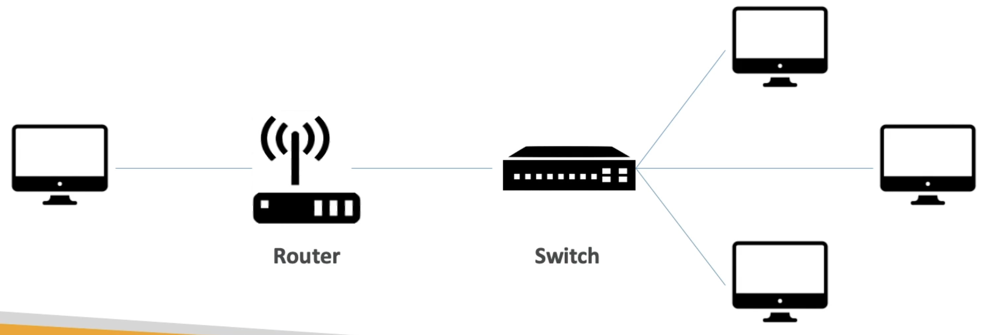
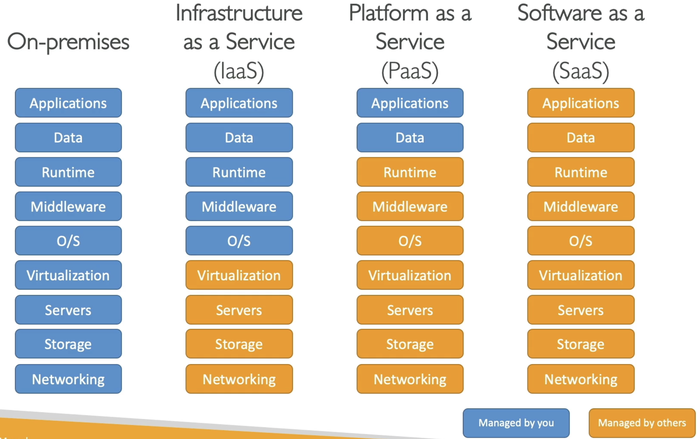
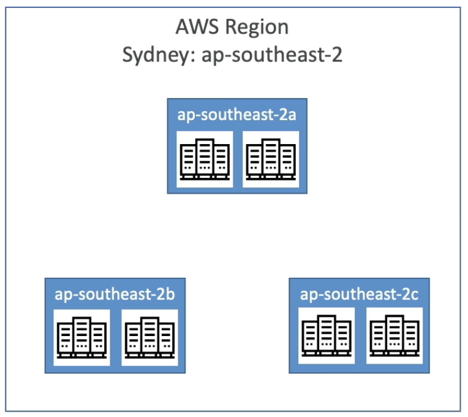

## Introduction to Cloud

Recall the client server model, where clients and servers communicate over some network. This is the basis of the internet.

**Network**: cables routers, and servers connected with each other
**Router**: A networking device that forwards data packets between networks. They know where to send packets across the internet
**Switch**: takes a packet and sends it to the correct machine on the network

There are problems with hosing your own servers at home that people/businesses don't want to deal with
- Rent for the physical space the servers take up
- Power, cooling, and 24/7 maintenance of the physical machines
- Scaling is limited
- Disaster recovery: earthquake, power shutdown, fire, etc.

Of course, the solution is to externalize all this, letting someone else deal with all of this on the **cloud**.

**Cloud Computing**: the *on-demand delivery* of compute, database storage, applications, and other IT resources.

5 Key Characteristics of cloud computing:
- **On demand self service:** provision resources without human interaction from the service provider
- **Broad network access:** resources available over the network can by accessed by diverse client platforms
- **Multi-tenancy & Resource pooling**: Multiple customers share the same physical infra and apps, while still ensuring security and privacy
- **Rapid elasticity & Scalability**: Automatically and quickly acquire and dispose resources when you need.
- **Measured Service**: Usage is measured, and you only pay for what you use (i.e. pay-as-you-go)

6 Key Advantages of cloud computing:
- **Trade CAPEX for OPEX**: You don't own the hardware, there's no up front CAPEX investment, you instead pay OPEX regularly, renting their hardware
- **Economies of Scale**: AWS has economies of scale running its machines, giving much better prices
- **Stop guessing capacity**: Scale based on actual measured usage, no need to guess how much compute you need
- **Increase speed and agility**: Cloud infrastructure is already setup and easy to use quickly
- **Stop spending on data centre maintenance**: OPEX to run data centres is also eliminated
- **Go global easily**: leverage the AWS global infrastructure as needed

## The Business of Cloud

#### Cloud Deployment Models

**Private Cloud:** Cloud services used by a single org, not exposed to the public. Secure for that org since no other businesses use it.
**Public Cloud**: Cloud resources owned and operated by a third-party cloud service delivered over the internet. This is Azure, GCP, and AWS.
**Hybrid Cloud**: Some servers are still on premises, which extend some of the capabilities offered on the cloud. Offers flexibility as a middle of the road approach. IBM cloud is known for this.

#### Cloud Service Models

**IaaS**: Infrastructure as a Service is the least managed by the cloud provider, and the most flexible for the customer. Provides the physical machines and network only. 
**PaaS**: Platform as a Service removes the need to manage the underlying infrastructre. This allows the customer on deployment and management of applications.
**SaaS**: Software as a Service is a complete product ran and managed by the service provider

#### AWS Pricing Model

**Compute:** pay for compute time
**Storage**: pay for data stored in the cloud
**Egress**: pay for data leaving the cloud, ingress is free to encourage customers to put their data into the cloud (and also then for vendor lock in...).

#### AWS Around the World

AWS has **regions** all over the world. Regions have names like `us-east-1`, `eu-west-3`, etc. that correspond to a cluster of data centres that are all nearby. Most AWS services are region-scoped, meaning resources in one region are isolated from the same service in another region, so using the service in multiple regions operates it separately in each (including for billing purposes). Some services are global though too.

Choose a region for a new app based on:
- Compliance: data governance and legal requirements might mean a need to keep comute to a specific region
- Proximity to customers: reduce latency by choosing a region near more customers
- Available Services: not all services are available in all regions
- Pricing: varies from region to region

Each region has many **availability zones**, usually 3, but a minimum of 3 and max of 6. Each availability zone has one or more data centres with its own networking & connectivity. Each AZ is connected with high bandwidth and ultra low latency to form a region

AWS also has 400+ **Points of Presence** (400+ Edge Locations, 10+ regional caches) all over the world. These are smaller edge sites that sit closer to users than full regions. Instead of running full compute stacks like a region does, they cache and deliver content with further reduced latency so every request doesn't have to go back to a region.

#### The Shared Responsibility Model

**AWS secures the cloud**: the physical data centres, hardware, networking infrastructure, regions, availability zones, and the foundational services (compute, storage, database, networking).

**You secure what’s in the cloud**: your data, applications, configuration, operating systems, firewall rules, encryption settings, and traffic protection.

![[images/what-is-cloud-computing/shared-responsibility-model.png]]